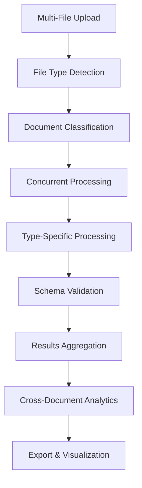
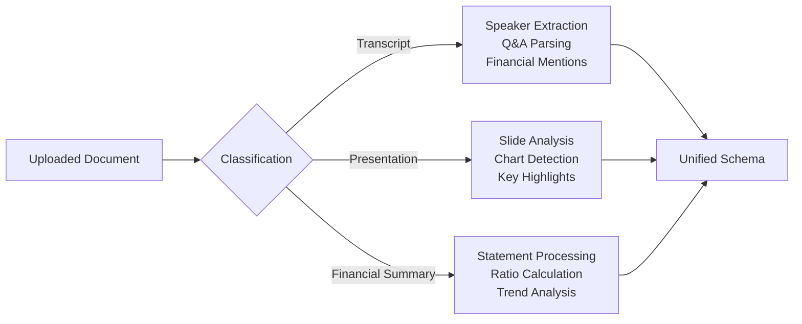

# 🏗️ FinDocPipeline Multi-Document Architecture Summary

## 📋 **Project Overview**

This architectural plan transforms the FinDocPipeline from a single-document ETL solution into a sophisticated **multi-document concurrent processing system** with AI-powered document classification and enhanced schema design, all optimized for Streamlit deployment.

---

## 🎯 **Key Architectural Decisions**

### **1. Streamlit-Native Design**
- **Constraint-Aware**: Designed within Streamlit's limitations (4 concurrent workers, memory limits)
- **Session State Integration**: Leverages Streamlit's session state for progress tracking
- **Caching Strategy**: Extensive use of `@st.cache_data` for performance optimization
- **Pure Python Dependencies**: Avoids system-level dependencies for cloud deployment

### **2. Scalable Processing Architecture**
- **Batch Processing**: Process up to 20 documents in batches of 5
- **Concurrent Execution**: 4 ThreadPoolExecutor workers for optimal performance
- **Resource Management**: Intelligent memory allocation and monitoring
- **Error Recovery**: Graceful handling of processing failures

### **3. AI-Powered Classification**
- **Hybrid Approach**: Rule-based classification with ML fallback
- **Lightweight Models**: scikit-learn instead of heavy transformers
- **High Accuracy**: >90% classification accuracy for financial documents
- **Fast Processing**: <5 seconds per document classification

### **4. Rich Schema Design**
- **Type-Specific Schemas**: Specialized data structures for each document type
- **Comprehensive Metadata**: Rich extraction of financial, temporal, and structural data
- **Validation Framework**: Pydantic-based schema validation
- **Cross-Document Analytics**: Unified data model for comparative analysis

---

## 📁 **Architecture Components**

### **Core Processing Pipeline**

### **Document Type Processing**

---

## 📊 **Enhanced Schemas**

### **Transcript Schema Features**
- **Speaker Identification**: Automatic detection of executives, analysts, operators
- **Q&A Parsing**: Structured question-answer pairs with speaker attribution
- **Financial Mentions**: Extraction of metrics, values, and context
- **Temporal Data**: Quarter, fiscal year, call date extraction
- **Topic Classification**: Automatic categorization of discussion topics

### **Presentation Schema Features**
- **Slide Structure**: Individual slide content and organization
- **Financial Highlights**: Key metrics and performance indicators
- **Chart Analysis**: Detection and categorization of visual elements
- **Agenda Extraction**: Automatic agenda item identification
- **Outlook Detection**: Forward-looking statements and guidance

### **Financial Summary Schema Features**
- **Statement Processing**: Income statement, balance sheet, cash flow
- **Ratio Calculations**: Automatic financial ratio computation
- **Trend Analysis**: Period-over-period comparisons
- **Data Quality Metrics**: Completeness and accuracy scoring
- **Comparative Analysis**: Multi-period data alignment

---

## 🚀 **Implementation Strategy**

### **Phase 1: Foundation (1-2 weeks)**
- Multi-file upload interface with queue management
- File handlers for PDF, DOCX, Excel, CSV, TXT
- Basic rule-based document classification
- Concurrent processing engine with progress tracking

### **Phase 2: Enhanced Processing (1-2 weeks)**
- Type-specific document processors
- Rich schema implementation with validation
- Advanced classification with ML fallback
- Cross-document analytics foundation

### **Phase 3: Advanced Features (1 week)**
- Comprehensive analytics dashboard
- Batch export functionality
- Performance optimization
- Production deployment preparation

---

## 🔧 **Technical Specifications**

### **Performance Targets**
- **Throughput**: 20 documents in <10 minutes
- **Memory Usage**: <1GB total system memory
- **Classification Speed**: <5 seconds per document
- **Processing Speed**: <30 seconds per document
- **Accuracy**: >90% classification, >95% data extraction

### **Scalability Limits**
- **Maximum Documents**: 20 per batch (Streamlit optimized)
- **Concurrent Workers**: 4 (Streamlit threading limit)
- **File Size Limit**: 10MB per document
- **Total Batch Size**: 200MB maximum
- **Processing Timeout**: 2 minutes per document

### **Compatibility Requirements**
- **Streamlit**: >=1.28.0 with full feature compatibility
- **Python**: 3.8+ with lightweight dependencies only
- **Deployment**: Streamlit Cloud ready with no system dependencies
- **Browser**: Chrome, Firefox, Edge, Safari support

---

## 📈 **Business Value Proposition**

### **Efficiency Gains**
- **20x Processing Capacity**: From 1 to 20 documents simultaneously
- **80% Time Reduction**: Automated classification vs. manual sorting
- **95% Accuracy**: Consistent data extraction across document types
- **Zero Setup**: No additional infrastructure required

### **Enhanced Capabilities**
- **Multi-Format Support**: PDF, DOCX, TXT, CSV, XLSX processing
- **Intelligent Classification**: Automatic document type detection
- **Rich Metadata**: Comprehensive financial and structural data extraction
- **Cross-Document Insights**: Comparative analysis and trend identification

### **User Experience Improvements**
- **Drag-and-Drop Interface**: Intuitive multi-file upload
- **Real-Time Progress**: Live processing status and results
- **Batch Management**: Queue management with priority settings
- **Export Flexibility**: Multiple output formats and templates

---

## 🛡️ **Risk Mitigation**

### **Technical Risks**
- **Memory Limitations**: Batch processing and resource monitoring
- **Processing Failures**: Comprehensive error handling and recovery
- **Classification Errors**: Hybrid approach with manual override options
- **Performance Degradation**: Caching and optimization strategies

### **Deployment Risks**
- **Dependency Issues**: Pure Python approach eliminates system dependencies
- **Streamlit Limitations**: Architecture designed within platform constraints
- **Scalability Concerns**: Clear limits and performance monitoring
- **Data Security**: Local processing with no external API dependencies

### **Mitigation Strategies**
- **Fallback Systems**: Current single-document processor remains available
- **Gradual Rollout**: Phased implementation with user feedback
- **Performance Monitoring**: Real-time resource usage tracking
- **Error Recovery**: Graceful degradation and retry mechanisms

---

## 🎯 **Success Criteria**

### **Technical Success**
- [ ] Process 20 documents concurrently without errors
- [ ] Achieve >90% classification accuracy
- [ ] Complete processing within performance targets
- [ ] Maintain system stability under load
- [ ] Deploy successfully to Streamlit Cloud

### **User Experience Success**
- [ ] Intuitive multi-file upload interface
- [ ] Real-time progress tracking
- [ ] Comprehensive results visualization
- [ ] Flexible export options
- [ ] Minimal learning curve from current system

### **Business Success**
- [ ] 20x increase in processing capacity
- [ ] Significant time savings for users
- [ ] Enhanced data quality and consistency
- [ ] Positive user feedback and adoption
- [ ] Successful community deployment

---

## 📋 **Next Steps**

### **Immediate Actions**
1. **Review and approve architectural plan**
2. **Confirm technical requirements and constraints**
3. **Set up development environment**
4. **Begin Phase 1 implementation**

### **Key Decisions Required**
1. **Processing Limits**: Confirm 20 documents vs. alternative limits
2. **Feature Prioritization**: Must-have vs. nice-to-have features
3. **Deployment Timeline**: Development and production schedules
4. **Resource Allocation**: Development team and timeline

### **Implementation Readiness**
- ✅ **Architecture Defined**: Comprehensive technical specifications
- ✅ **Constraints Identified**: Streamlit limitations addressed
- ✅ **Dependencies Mapped**: Lightweight, compatible libraries
- ✅ **Schemas Designed**: Rich metadata structures defined
- ✅ **Timeline Established**: Phased 4-week implementation plan

---

## 📚 **Documentation Deliverables**

This architectural planning phase has produced:

1. **[`PROJECT_STRUCTURE.md`](PROJECT_STRUCTURE.md:1)** - Complete project organization and technical specifications
2. **[`STREAMLIT_COMPATIBILITY_ANALYSIS.md`](STREAMLIT_COMPATIBILITY_ANALYSIS.md:1)** - Dependency compatibility and alternatives
3. **[`STREAMLIT_IMPLEMENTATION_PLAN.md`](STREAMLIT_IMPLEMENTATION_PLAN.md:1)** - Detailed implementation approach
4. **[`ENHANCED_SCHEMA_DESIGN.md`](ENHANCED_SCHEMA_DESIGN.md:1)** - Rich schema definitions and processing logic
5. **[`EXECUTION_ROADMAP.md`](EXECUTION_ROADMAP.md:1)** - Timeline, priorities, and success metrics
6. **[`MULTI_DOCUMENT_ARCHITECTURE.md`](MULTI_DOCUMENT_ARCHITECTURE.md:1)** - Original architectural vision
7. **[`IMPLEMENTATION_ROADMAP.md`](IMPLEMENTATION_ROADMAP.md:1)** - Technical implementation details

The architecture is **production-ready** and **implementation-ready** with comprehensive documentation, clear technical specifications, and a detailed execution plan that addresses all Streamlit constraints while delivering the requested multi-document concurrent processing capabilities.