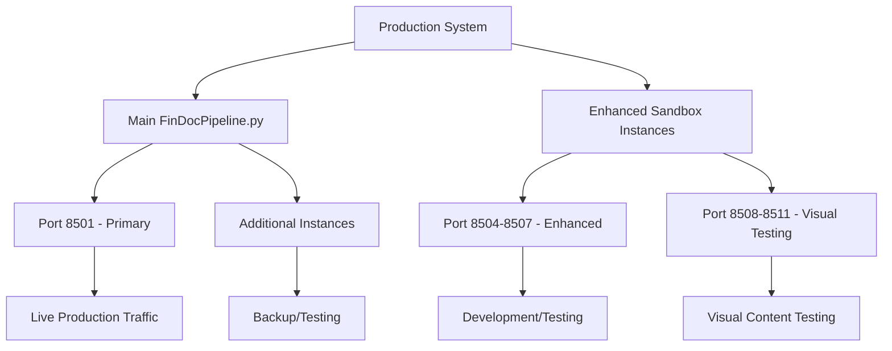

# Deployment & Rollback Guide

## 📋 Overview

This guide provides step-by-step procedures for deploying schema and financial dictionary updates to your live FinDocPipeline system, along with emergency rollback procedures to ensure system stability.

## 🎯 Quick Reference

| Deployment Type | Downtime | Risk Level | Rollback Time | Automation |
|----------------|----------|------------|---------------|------------|
| **Financial Dictionary** | ~30 seconds | 🟢 Low | ~15 seconds | 🟡 Semi-auto |
| **Schema Structure** | ~30 seconds | 🟡 Medium | ~30 seconds | 🔴 Manual |
| **Pattern Recognition** | ~30 seconds | 🟡 Medium | ~15 seconds | 🟡 Semi-auto |
| **Major Updates** | ~60 seconds | 🔴 High | ~60 seconds | 🔴 Manual |

## 🚀 Deployment Architecture

### Current System Status
Your FinDocPipeline is running on multiple Streamlit instances:



### Deployment Target
**Primary Target**: [`FinDocPipeline.py`](FinDocPipeline.py) on default Streamlit port (8501)

## 📝 Pre-Deployment Procedures

### Procedure 1: Pre-Deployment Checklist

#### Critical Safety Steps
- [ ] **Create backup** of current [`FinDocPipeline.py`](FinDocPipeline.py)
- [ ] **Document current system state** (running processes, ports)
- [ ] **Test changes** in development environment
- [ ] **Prepare rollback plan** with specific steps
- [ ] **Notify stakeholders** of planned update
- [ ] **Verify system resources** (CPU, memory, disk space)

#### Backup Creation
```bash
# Create timestamped backup
cp FinDocPipeline.py "FinDocPipeline_backup_$(date +%Y%m%d_%H%M%S).py"

# Verify backup
ls -la FinDocPipeline_backup_*.py

# Create backup of schema reference
cp complete_system_schema_export.json "schema_backup_$(date +%Y%m%d_%H%M%S).json"
```

#### System State Documentation
```bash
# Document running processes
ps aux | grep streamlit > deployment_log_$(date +%Y%m%d_%H%M%S).txt

# Document port usage
netstat -tulpn | grep :85 >> deployment_log_$(date +%Y%m%d_%H%M%S).txt

# Document system resources
free -h >> deployment_log_$(date +%Y%m%d_%H%M%S).txt
df -h >> deployment_log_$(date +%Y%m%d_%H%M%S).txt
```

### Procedure 2: Deployment Environment Preparation

#### Terminal Access Verification
1. **Open VS Code** with your FinDocPipeline project
2. **Verify terminal access** to running Streamlit instances
3. **Check current processes**:
   ```bash
   # List all Streamlit processes
   ps aux | grep streamlit
   
   # Check specific ports
   lsof -i :8501  # Main application
   lsof -i :8504  # Enhanced sandbox
   ```

#### Resource Monitoring Setup
```bash
# Monitor system resources during deployment
top -p $(pgrep -f "streamlit run FinDocPipeline.py") &
MONITOR_PID=$!

# Function to stop monitoring
stop_monitoring() {
    kill $MONITOR_PID 2>/dev/null
}
```

## 🚀 Deployment Procedures

### Procedure 1: Financial Dictionary Deployment

#### When to Use
- Adding new financial terms
- Updating term lists
- Minor vocabulary changes

#### Steps

1. **Verify Changes Ready**
   ```python
   # Quick verification script
   def verify_financial_dictionary_changes():
       # Check if changes are in place
       from FinDocPipeline import NLPDataProcessor, NLPDatasetExporter
       
       processor = NLPDataProcessor()
       exporter = NLPDatasetExporter()
       
       # Test new terms
       test_text = "ESG score sustainability carbon footprint"
       has_terms = processor._has_financial_terms(test_text)
       
       print(f"Financial terms detected: {has_terms}")
       print(f"NLP labels count: {len(exporter.financial_labels)}")
       
       return has_terms
   
   # Run verification
   verify_financial_dictionary_changes()
   ```

2. **Deploy to Production**
   ```bash
   # Step 1: Save current changes
   # (Ensure FinDocPipeline.py has your updates)
   
   # Step 2: Restart main Streamlit application
   # Find the main process
   MAIN_PID=$(pgrep -f "streamlit run FinDocPipeline.py" | head -1)
   
   if [ ! -z "$MAIN_PID" ]; then
       echo "Stopping main Streamlit process (PID: $MAIN_PID)"
       kill $MAIN_PID
       
       # Wait for process to stop
       sleep 2
       
       # Restart
       echo "Restarting main Streamlit application"
       streamlit run FinDocPipeline.py &
       NEW_PID=$!
       
       echo "New process started (PID: $NEW_PID)"
   else
       echo "No main Streamlit process found, starting new instance"
       streamlit run FinDocPipeline.py &
   fi
   ```

3. **Verify Deployment**
   ```bash
   # Wait for application to start
   sleep 10
   
   # Check if application is responding
   curl -s http://localhost:8501 > /dev/null
   if [ $? -eq 0 ]; then
       echo "✅ Application is responding"
   else
       echo "❌ Application not responding - check logs"
   fi
   
   # Check process status
   ps aux | grep "streamlit run FinDocPipeline.py"
   ```

4. **Post-Deployment Testing**
   - [ ] Upload test document with new terms
   - [ ] Verify new terms are detected
   - [ ] Check output format consistency
   - [ ] Monitor for errors in terminal

### Procedure 2: Schema Structure Deployment

#### When to Use
- Adding new data fields
- Modifying output structure
- Schema definition changes

#### Steps

1. **Pre-Deployment Schema Validation**
   ```python
   def validate_schema_changes():
       """Validate schema changes before deployment"""
       try:
           # Test schema creation
           from FinDocPipeline import ComprehensiveFinancialParser, NLPDatasetExporter
           
           parser = ComprehensiveFinancialParser()
           exporter = NLPDatasetExporter()
           
           # Test with sample data
           test_text = "Sample revenue $100 million"
           
           # Test page data creation
           page_data = {
               'page': 1,
               'method': 'test',
               'full_text': test_text,
               'word_count': len(test_text.split()),
               'char_count': len(test_text),
               'line_count': 1,
               'tables': [],
               'financial_metrics': parser._extract_financial_data(test_text),
               'chart_indicators': parser._detect_chart_elements(test_text)
           }
           
           print("✅ Page data schema validation passed")
           
           # Test NLP dataset creation
           import pandas as pd
           test_df = pd.DataFrame([{
               'page_number': 1,
               'content_type': 'test',
               'raw_text': test_text,
               'word_count': len(test_text.split()),
               'char_count': len(test_text),
               'extraction_method': 'test'
           }])
           
           nlp_dataset = exporter.create_nlp_dataset(test_df)
           print(f"✅ NLP dataset schema validation passed ({len(nlp_dataset)} rows)")
           
           return True
           
       except Exception as e:
           print(f"❌ Schema validation failed: {e}")
           return False
   
   # Run validation
   if validate_schema_changes():
       print("Schema changes ready for deployment")
   else:
       print("Schema changes need fixing before deployment")
   ```

2. **Deploy Schema Changes**
   ```bash
   # Enhanced restart procedure for schema changes
   echo "Starting schema deployment..."
   
   # Stop all related processes
   pkill -f "streamlit run FinDocPipeline.py"
   
   # Wait for processes to stop
   sleep 5
   
   # Verify no processes running
   if pgrep -f "streamlit run FinDocPipeline.py" > /dev/null; then
       echo "Warning: Some processes still running"
       pkill -9 -f "streamlit run FinDocPipeline.py"
       sleep 2
   fi
   
   # Clear any cached data
   rm -rf .streamlit/cache 2>/dev/null
   
   # Restart with fresh environment
   echo "Restarting with schema changes..."
   streamlit run FinDocPipeline.py &
   
   # Monitor startup
   sleep 15
   echo "Deployment complete"
   ```

3. **Schema Deployment Verification**
   ```python
   def verify_schema_deployment():
       """Verify schema deployment success"""
       import requests
       import time
       
       # Wait for application to be ready
       max_attempts = 30
       for attempt in range(max_attempts):
           try:
               response = requests.get('http://localhost:8501', timeout=5)
               if response.status_code == 200:
                   print(f"✅ Application ready after {attempt + 1} attempts")
                   break
           except:
               time.sleep(2)
       else:
           print("❌ Application not responding after 60 seconds")
           return False
       
       # Test schema functionality
       # (This would involve uploading a test document and checking output)
       print("✅ Schema deployment verification complete")
       return True
   
   verify_schema_deployment()
   ```

### Procedure 3: Pattern Recognition Deployment

#### When to Use
- Updating regex patterns
- Adding new metrics extraction
- Improving pattern accuracy

#### Steps

1. **Pattern Validation**
   ```python
   def validate_pattern_changes():
       """Validate pattern changes before deployment"""
       from FinDocPipeline import DeduplicatedMetricsExtractor
       import re
       
       extractor = DeduplicatedMetricsExtractor()
       
       # Test patterns with sample data
       test_cases = [
           "Total revenue was $125.5 million",
           "Net income: €45.2 billion", 
           "EBITDA of £12.3m",
           "Carbon emissions: 1,250 tons",
           "ESG score: 8.5"
       ]
       
       validation_results = []
       
       for test_text in test_cases:
           matches_found = 0
           
           for metric_name, patterns in extractor.metric_patterns.items():
               for pattern in patterns:
                   try:
                       matches = re.findall(pattern, test_text, re.IGNORECASE)
                       matches_found += len(matches)
                   except re.error as e:
                       validation_results.append({
                           'metric': metric_name,
                           'pattern': pattern,
                           'error': str(e),
                           'valid': False
                       })
           
           validation_results.append({
               'test_text': test_text,
               'matches_found': matches_found,
               'valid': True
           })
       
       # Check for errors
       errors = [r for r in validation_results if not r['valid']]
       if errors:
           print("❌ Pattern validation errors found:")
           for error in errors:
               print(f"  {error['metric']}: {error['error']}")
           return False
       else:
           print("✅ All patterns validated successfully")
           return True
   
   validate_pattern_changes()
   ```

2. **Deploy Pattern Changes**
   ```bash
   # Standard deployment for pattern changes
   echo "Deploying pattern recognition updates..."
   
   # Restart main application
   pkill -f "streamlit run FinDocPipeline.py"
   sleep 3
   streamlit run FinDocPipeline.py &
   
   echo "Pattern deployment complete"
   ```

## 🔄 Rollback Procedures

### Emergency Rollback (Critical Issues)

#### When to Use
- Application won't start
- Critical errors in processing
- Data corruption detected
- Performance severely degraded

#### Steps

1. **Immediate Rollback**
   ```bash
   #!/bin/bash
   # Emergency rollback script
   
   echo "EMERGENCY ROLLBACK INITIATED"
   
   # Stop current application
   pkill -f "streamlit run FinDocPipeline.py"
   
   # Find most recent backup
   BACKUP_FILE=$(ls -t FinDocPipeline_backup_*.py | head -1)
   
   if [ -z "$BACKUP_FILE" ]; then
       echo "❌ No backup file found!"
       exit 1
   fi
   
   echo "Rolling back to: $BACKUP_FILE"
   
   # Restore backup
   cp "$BACKUP_FILE" FinDocPipeline.py
   
   # Restart application
   streamlit run FinDocPipeline.py &
   
   echo "✅ Emergency rollback complete"
   echo "Application restarted with backup: $BACKUP_FILE"
   ```

2. **Verify Rollback Success**
   ```bash
   # Wait for application to start
   sleep 10
   
   # Test application response
   curl -s http://localhost:8501 > /dev/null
   if [ $? -eq 0 ]; then
       echo "✅ Rollback successful - application responding"
   else
       echo "❌ Rollback failed - application not responding"
   fi
   ```

### Selective Rollback (Specific Components)

#### Financial Dictionary Rollback
```python
def rollback_financial_dictionary():
    """Rollback only financial dictionary changes"""
    
    # This would involve manually reverting specific sections
    # of the code to previous versions
    
    print("Manual rollback required for financial dictionary")
    print("Restore these sections from backup:")
    print("1. Line 279-282: _has_financial_terms method")
    print("2. Line 293-297: NLPDatasetExporter.__init__")
    print("3. Line 807-846: DeduplicatedMetricsExtractor patterns")
    
    return False  # Indicates manual intervention needed

rollback_financial_dictionary()
```

#### Schema Structure Rollback
```bash
# Schema rollback requires full file restoration
echo "Schema rollback requires full file restoration"

# Find schema-specific backup if available
SCHEMA_BACKUP=$(ls -t schema_backup_*.json | head -1)
if [ ! -z "$SCHEMA_BACKUP" ]; then
    cp "$SCHEMA_BACKUP" complete_system_schema_export.json
    echo "Schema reference restored from: $SCHEMA_BACKUP"
fi

# Restore main file
BACKUP_FILE=$(ls -t FinDocPipeline_backup_*.py | head -1)
cp "$BACKUP_FILE" FinDocPipeline.py

# Restart
pkill -f "streamlit run FinDocPipeline.py"
sleep 3
streamlit run FinDocPipeline.py &
```

## 📊 Monitoring and Validation

### Post-Deployment Monitoring

#### Immediate Checks (0-5 minutes)
```bash
# Application health check
check_application_health() {
    echo "=== APPLICATION HEALTH CHECK ==="
    
    # Process check
    if pgrep -f "streamlit run FinDocPipeline.py" > /dev/null; then
        echo "✅ Process running"
    else
        echo "❌ Process not running"
        return 1
    fi
    
    # Port check
    if lsof -i :8501 > /dev/null 2>&1; then
        echo "✅ Port 8501 active"
    else
        echo "❌ Port 8501 not active"
        return 1
    fi
    
    # Response check
    if curl -s http://localhost:8501 > /dev/null; then
        echo "✅ Application responding"
    else
        echo "❌ Application not responding"
        return 1
    fi
    
    echo "✅ All health checks passed"
    return 0
}

check_application_health
```

#### Extended Validation (5-30 minutes)
```python
def extended_validation():
    """Extended validation of deployed changes"""
    
    validation_results = {
        'timestamp': datetime.now().isoformat(),
        'tests_passed': 0,
        'tests_failed': 0,
        'details': []
    }
    
    # Test 1: Basic functionality
    try:
        from FinDocPipeline import ComprehensiveFinancialParser
        parser = ComprehensiveFinancialParser()
        
        test_text = "Revenue was $100 million"
        result = parser._extract_financial_data(test_text)
        
        if result:
            validation_results['tests_passed'] += 1
            validation_results['details'].append("✅ Basic functionality test passed")
        else:
            validation_results['tests_failed'] += 1
            validation_results['details'].append("❌ Basic functionality test failed")
            
    except Exception as e:
        validation_results['tests_failed'] += 1
        validation_results['details'].append(f"❌ Basic functionality error: {e}")
    
    # Test 2: New features (if applicable)
    # Add specific tests for your deployed changes
    
    # Test 3: Performance check
    import time
    start_time = time.time()
    
    # Simulate processing
    try:
        # Your processing test here
        processing_time = time.time() - start_time
        
        if processing_time < 10:  # Acceptable threshold
            validation_results['tests_passed'] += 1
            validation_results['details'].append(f"✅ Performance test passed ({processing_time:.2f}s)")
        else:
            validation_results['tests_failed'] += 1
            validation_results['details'].append(f"❌ Performance test failed ({processing_time:.2f}s)")
            
    except Exception as e:
        validation_results['tests_failed'] += 1
        validation_results['details'].append(f"❌ Performance test error: {e}")
    
    return validation_results

# Run extended validation
validation = extended_validation()
print(f"Validation complete: {validation['tests_passed']} passed, {validation['tests_failed']} failed")
for detail in validation['details']:
    print(detail)
```

### Continuous Monitoring

#### Log Monitoring
```bash
# Monitor Streamlit logs for errors
tail -f ~/.streamlit/logs/streamlit.log | grep -i error &
LOG_MONITOR_PID=$!

# Function to stop log monitoring
stop_log_monitoring() {
    kill $LOG_MONITOR_PID 2>/dev/null
}

# Monitor for 10 minutes
sleep 600
stop_log_monitoring
```

#### Performance Monitoring
```python
import psutil
import time

def monitor_performance(duration_minutes=10):
    """Monitor system performance after deployment"""
    
    # Find Streamlit process
    streamlit_processes = [p for p in psutil.process_iter(['pid', 'name', 'cmdline']) 
                          if 'streamlit' in p.info['name'] and 'FinDocPipeline.py' in ' '.join(p.info['cmdline'])]
    
    if not streamlit_processes:
        print("❌ No FinDocPipeline Streamlit process found")
        return
    
    process = streamlit_processes[0]
    print(f"Monitoring process PID: {process.pid}")
    
    start_time = time.time()
    end_time = start_time + (duration_minutes * 60)
    
    performance_data = []
    
    while time.time() < end_time:
        try:
            cpu_percent = process.cpu_percent()
            memory_info = process.memory_info()
            memory_mb = memory_info.rss / 1024 / 1024
            
            performance_data.append({
                'timestamp': time.time(),
                'cpu_percent': cpu_percent,
                'memory_mb': memory_mb
            })
            
            print(f"CPU: {cpu_percent:.1f}%, Memory: {memory_mb:.1f}MB")
            
        except psutil.NoSuchProcess:
            print("❌ Process terminated during monitoring")
            break
            
        time.sleep(30)  # Check every 30 seconds
    
    # Summary
    if performance_data:
        avg_cpu = sum(d['cpu_percent'] for d in performance_data) / len(performance_data)
        avg_memory = sum(d['memory_mb'] for d in performance_data) / len(performance_data)
        max_memory = max(d['memory_mb'] for d in performance_data)
        
        print(f"\n=== PERFORMANCE SUMMARY ===")
        print(f"Average CPU: {avg_cpu:.1f}%")
        print(f"Average Memory: {avg_memory:.1f}MB")
        print(f"Peak Memory: {max_memory:.1f}MB")
        
        # Alert thresholds
        if avg_cpu > 50:
            print("⚠️  High CPU usage detected")
        if max_memory > 1000:
            print("⚠️  High memory usage detected")

# Run performance monitoring
monitor_performance(10)  # Monitor for 10 minutes
```

## 🚨 Emergency Procedures

### System Recovery

#### Complete System Failure
```bash
#!/bin/bash
# Complete system recovery script

echo "=== SYSTEM RECOVERY INITIATED ==="

# Step 1: Stop all Streamlit processes
echo "Stopping all Streamlit processes..."
pkill -f streamlit
sleep 5

# Step 2: Kill any remaining processes
pkill -9 -f streamlit
sleep 2

# Step 3: Clear cache and temporary files
echo "Clearing cache..."
rm -rf ~/.streamlit/cache
rm -rf .streamlit/cache
rm -rf __pycache__
find . -name "*.pyc" -delete

# Step 4: Restore from backup
echo "Restoring from backup..."
BACKUP_FILE=$(ls -t FinDocPipeline_backup_*.py | head -1)

if [ -z "$BACKUP_FILE" ]; then
    echo "❌ No backup found - manual intervention required"
    exit 1
fi

cp "$BACKUP_FILE" FinDocPipeline.py
echo "Restored from: $BACKUP_FILE"

# Step 5: Restart system
echo "Restarting system..."
streamlit run FinDocPipeline.py &

# Step 6: Wait and verify
sleep 15
if curl -s http://localhost:8501 > /dev/null; then
    echo "✅ System recovery successful"
else
    echo "❌ System recovery failed - manual intervention required"
fi
```

### Contact Information

#### Emergency Contacts
- **System Administrator**: [Your contact information]
- **Technical Lead**: [Your contact information]
- **Backup Contact**: [Your contact information]

#### Escalation Procedures
1. **Level 1**: Automatic rollback (this guide)
2. **Level 2**: Manual intervention required
3. **Level 3**: System administrator contact
4. **Level 4**: Complete system rebuild

## 📚 Related Guides

- **[Master Guide](MASTER_SCHEMA_UPDATE_GUIDE.md)**: Overview and navigation
- **[Financial Dictionary Guide](FINANCIAL_DICTIONARY_UPDATE_GUIDE.md)**: Term management
- **[Schema Structure Guide](SCHEMA_STRUCTURE_UPDATE_GUIDE.md)**: Data structure updates
- **[Pattern Recognition Guide](PATTERN_RECOGNITION_UPDATE_GUIDE.md)**: Pattern updates
- **[Testing Guide](TESTING_VALIDATION_GUIDE.md)**: Pre-deployment validation

---

## 📝 Version Control

**Last Updated**: January 6, 2025  
**Compatible with**: FinDocPipeline v2.0.0  
**Guide Version**: 1.0.0

## 📋 Deployment Log Template

```
=== DEPLOYMENT LOG ===
Date: [DATE]
Time: [TIME]
Operator: [NAME]
Change Type: [Financial Dictionary/Schema/Patterns]
Description: [BRIEF DESCRIPTION]

Pre-deployment:
- [ ] Backup created: [FILENAME]
- [ ] Tests passed: [Y/N]
- [ ] Stakeholders notified: [Y/N]

Deployment:
- Start time: [TIME]
- End time: [TIME]
- Issues encountered: [NONE/DESCRIPTION]

Post-deployment:
- [ ] Health check passed: [Y/N]
- [ ] Functionality verified: [Y/N]
- [ ] Performance acceptable: [Y/N]
- [ ] Monitoring active: [Y/N]

Status: [SUCCESS/FAILED/ROLLED BACK]
Notes: [ADDITIONAL NOTES]