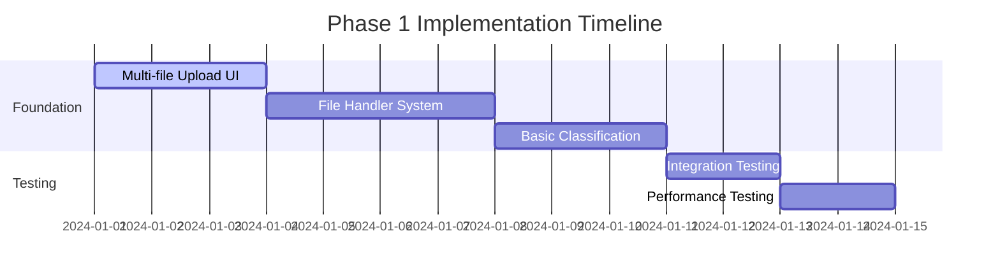
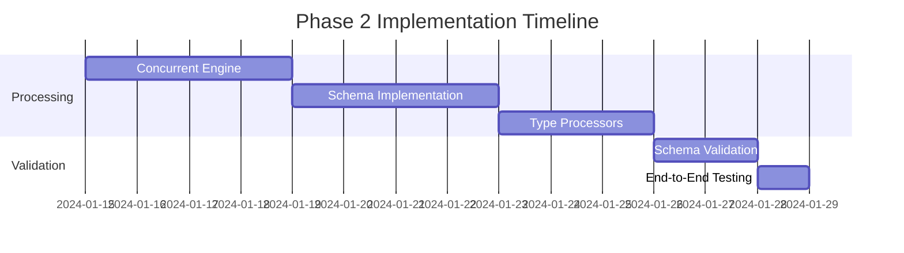
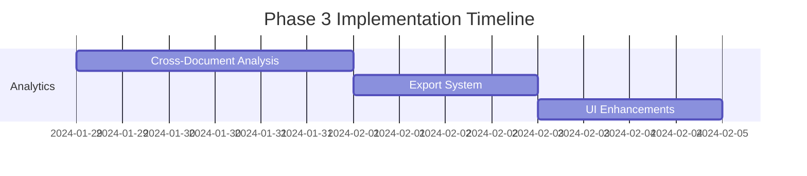

# 🚀 Multi-Document Processing Execution Roadmap

## 📋 **Executive Summary**

This roadmap transforms the FinDocPipeline from a single-document processor into a sophisticated multi-document concurrent processing system with AI-powered classification and rich schema design, all optimized for Streamlit deployment.

**Key Deliverables:**
- ✅ Multi-format file support (PDF, DOCX, TXT, CSV, XLSX)
- ✅ Concurrent processing (up to 20 documents, 4 workers)
- ✅ AI-powered document classification
- ✅ Enhanced schemas with rich metadata
- ✅ Real-time progress tracking
- ✅ Cross-document analytics

---

## 🎯 **Implementation Timeline**

### **Phase 1: Foundation & Multi-File Support** 
*Duration: 1-2 weeks | Priority: HIGH*

#### **Week 1: Core Infrastructure**


**Day 1-3: Multi-File Upload Interface**
- [ ] Create [`ui/multi_upload_streamlit.py`](ui/multi_upload_streamlit.py:1)
- [ ] Implement file queue management
- [ ] Add file preview capabilities
- [ ] Integrate with session state

**Day 4-7: File Handler System**
- [ ] Create [`file_handlers/streamlit_handlers.py`](file_handlers/streamlit_handlers.py:1)
- [ ] Implement PDF handler with caching
- [ ] Implement DOCX handler with caching
- [ ] Implement Excel handler with caching
- [ ] Add CSV and TXT handlers

**Day 8-10: Basic Classification**
- [ ] Create [`classification/streamlit_classifier.py`](classification/streamlit_classifier.py:1)
- [ ] Implement rule-based classification
- [ ] Add filename-based detection
- [ ] Create classification confidence scoring

**Day 11-14: Testing & Integration**
- [ ] Unit tests for all handlers
- [ ] Integration testing with Streamlit
- [ ] Performance optimization
- [ ] Error handling improvements

---

### **Phase 2: Enhanced Processing & Schemas**
*Duration: 1-2 weeks | Priority: HIGH*

#### **Week 2-3: Advanced Processing**


**Day 1-4: Concurrent Processing Engine**
- [ ] Create [`processing/streamlit_concurrent.py`](processing/streamlit_concurrent.py:1)
- [ ] Implement batch processing logic
- [ ] Add progress tracking with session state
- [ ] Create resource management system

**Day 5-8: Schema Implementation**
- [ ] Create [`schemas/base_schema.py`](schemas/base_schema.py:1)
- [ ] Implement [`schemas/transcript_schema.py`](schemas/transcript_schema.py:1)
- [ ] Implement [`schemas/presentation_schema.py`](schemas/presentation_schema.py:1)
- [ ] Implement [`schemas/summary_schema.py`](schemas/summary_schema.py:1)

**Day 9-11: Type-Specific Processors**
- [ ] Create [`processing/transcript_processor.py`](processing/transcript_processor.py:1)
- [ ] Create [`processing/presentation_processor.py`](processing/presentation_processor.py:1)
- [ ] Create [`processing/summary_processor.py`](processing/summary_processor.py:1)

**Day 12-14: Validation & Testing**
- [ ] Schema validation system
- [ ] End-to-end testing
- [ ] Performance optimization

---

### **Phase 3: Advanced Features & Analytics**
*Duration: 1 week | Priority: MEDIUM*

#### **Week 4: Advanced Features**


**Day 1-3: Cross-Document Analytics**
- [ ] Create [`analytics/cross_document_analyzer.py`](analytics/cross_document_analyzer.py:1)
- [ ] Implement trend analysis
- [ ] Add comparative metrics
- [ ] Create analytics dashboard

**Day 4-5: Export System**
- [ ] Create [`utils/export_utils.py`](utils/export_utils.py:1)
- [ ] Implement batch export functionality
- [ ] Add multiple export formats
- [ ] Create export templates

**Day 6-7: UI Enhancements**
- [ ] Enhanced progress dashboard
- [ ] Results visualization
- [ ] Batch management interface
- [ ] Error handling UI

---

## 📁 **Detailed Implementation Steps**

### **Step 1: Project Structure Setup**

```bash
# Create directory structure
mkdir -p file_handlers classification schemas processing ui analytics utils tests config
touch file_handlers/__init__.py classification/__init__.py schemas/__init__.py
touch processing/__init__.py ui/__init__.py analytics/__init__.py utils/__init__.py
```

### **Step 2: Enhanced Requirements**

Create `requirements_enhanced.txt`:
```python
# Current dependencies (keep existing)
streamlit>=1.28.0
pandas>=2.0.0
numpy>=1.24.0
pdfplumber>=0.9.0
PyMuPDF>=1.23.0
opencv-python-headless>=4.8.0
pytesseract>=0.3.10
Pillow>=10.0.0
regex>=2023.8.8
openpyxl>=3.1.2

# New lightweight dependencies
python-docx>=0.8.11
xlrd>=2.0.1
filetype>=1.2.0
chardet>=5.2.0
pydantic>=2.0.0
scikit-learn>=1.3.0
nltk>=3.8.1
textstat>=0.7.3
plotly>=5.15.0
psutil>=5.9.0
tqdm>=4.65.0
```

### **Step 3: Core Implementation Priority**

#### **High Priority (Must Have)**
1. **Multi-file upload interface** - Essential for user experience
2. **File handlers for PDF, DOCX, Excel** - Core functionality
3. **Basic document classification** - Required for type-specific processing
4. **Concurrent processing engine** - Key performance feature
5. **Enhanced schemas** - Foundation for rich metadata

#### **Medium Priority (Should Have)**
1. **Advanced classification with ML** - Improves accuracy
2. **Cross-document analytics** - Valuable insights
3. **Export functionality** - User convenience
4. **Progress tracking UI** - Better user experience

#### **Low Priority (Nice to Have)**
1. **Advanced NLP features** - Future enhancement
2. **Custom classification training** - Advanced feature
3. **API endpoints** - Future integration
4. **Advanced visualizations** - Polish feature

---

## 🔧 **Technical Implementation Guide**

### **Implementation Pattern**

Each component follows this pattern:
1. **Create base class/interface**
2. **Implement Streamlit-specific version**
3. **Add caching with `@st.cache_data`**
4. **Include error handling**
5. **Add progress tracking**
6. **Write unit tests**

### **Example Implementation Workflow**

#### **File Handler Implementation**
```python
# 1. Create base interface
class BaseFileHandler(ABC):
    @abstractmethod
    def extract_content(self, uploaded_file) -> Dict[str, Any]:
        pass

# 2. Implement specific handler
class StreamlitPDFHandler(BaseFileHandler):
    def extract_content(self, uploaded_file) -> Dict[str, Any]:
        file_bytes = uploaded_file.read()
        return self._extract_pdf_cached(file_bytes, uploaded_file.name)
    
    @st.cache_data
    def _extract_pdf_cached(_self, file_bytes: bytes, filename: str) -> Dict[str, Any]:
        # Implementation with caching
        pass

# 3. Add to handler registry
HANDLERS = {
    'pdf': StreamlitPDFHandler(),
    'docx': StreamlitDOCXHandler(),
    'xlsx': StreamlitExcelHandler()
}
```

### **Testing Strategy**

#### **Unit Testing**
```python
# tests/test_file_handlers.py
def test_pdf_handler():
    handler = StreamlitPDFHandler()
    # Test with sample PDF
    pass

def test_docx_handler():
    handler = StreamlitDOCXHandler()
    # Test with sample DOCX
    pass
```

#### **Integration Testing**
```python
# tests/test_integration.py
def test_full_pipeline():
    # Test complete document processing pipeline
    pass

def test_concurrent_processing():
    # Test concurrent processing with multiple files
    pass
```

---

## 📊 **Success Metrics & Validation**

### **Performance Targets**
- **Processing Speed**: < 30 seconds per document
- **Memory Usage**: < 1GB total
- **Concurrent Limit**: 4 workers, 20 documents max
- **Classification Accuracy**: > 90% for rule-based, > 85% for ML
- **Error Rate**: < 5% processing failures

### **Quality Metrics**
- **Schema Completeness**: > 80% fields populated
- **Data Extraction Accuracy**: > 95% for structured data
- **User Experience**: < 3 clicks to process batch
- **Error Recovery**: Graceful handling of all error types

### **Validation Checklist**

#### **Phase 1 Validation**
- [ ] Upload 20 mixed documents successfully
- [ ] All file types process without errors
- [ ] Classification accuracy > 85%
- [ ] Progress tracking works correctly
- [ ] Session state maintains data

#### **Phase 2 Validation**
- [ ] Concurrent processing completes successfully
- [ ] Schemas validate correctly
- [ ] Type-specific processing works
- [ ] Memory usage stays under limits
- [ ] Error handling works properly

#### **Phase 3 Validation**
- [ ] Cross-document analytics generate insights
- [ ] Export functionality works
- [ ] UI is responsive and intuitive
- [ ] Performance meets targets
- [ ] System is production-ready

---

## 🚀 **Deployment Strategy**

### **Development Environment**
1. **Local Development**: Use existing Streamlit setup
2. **Testing**: Create test data sets for each document type
3. **Performance Testing**: Test with maximum file limits

### **Production Deployment**
1. **Streamlit Cloud**: Deploy with enhanced requirements
2. **Resource Monitoring**: Monitor memory and CPU usage
3. **Error Tracking**: Implement comprehensive logging
4. **User Feedback**: Collect usage analytics

### **Rollback Plan**
- Keep current [`FinDocPipeline.py`](FinDocPipeline.py:1) as fallback
- Create [`FinDocPipeline_Enhanced.py`](FinDocPipeline_Enhanced.py:1) for new version
- Allow users to switch between versions if needed

---

## 🎯 **Next Steps**

### **Immediate Actions (This Week)**
1. **Review and approve this roadmap**
2. **Set up development environment**
3. **Create project structure**
4. **Begin Phase 1 implementation**

### **Decision Points**
1. **Confirm file limits**: 20 documents vs. 50 documents
2. **Choose ML approach**: Rule-based vs. lightweight ML vs. heavy ML
3. **Deployment target**: Streamlit Cloud vs. self-hosted
4. **Feature prioritization**: Must-have vs. nice-to-have features

This roadmap provides a clear path to transform the FinDocPipeline into a sophisticated multi-document processing system while maintaining Streamlit compatibility and ensuring robust performance.