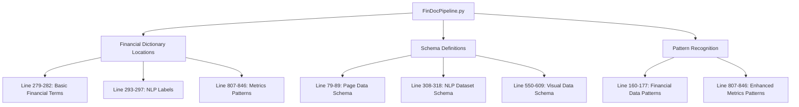
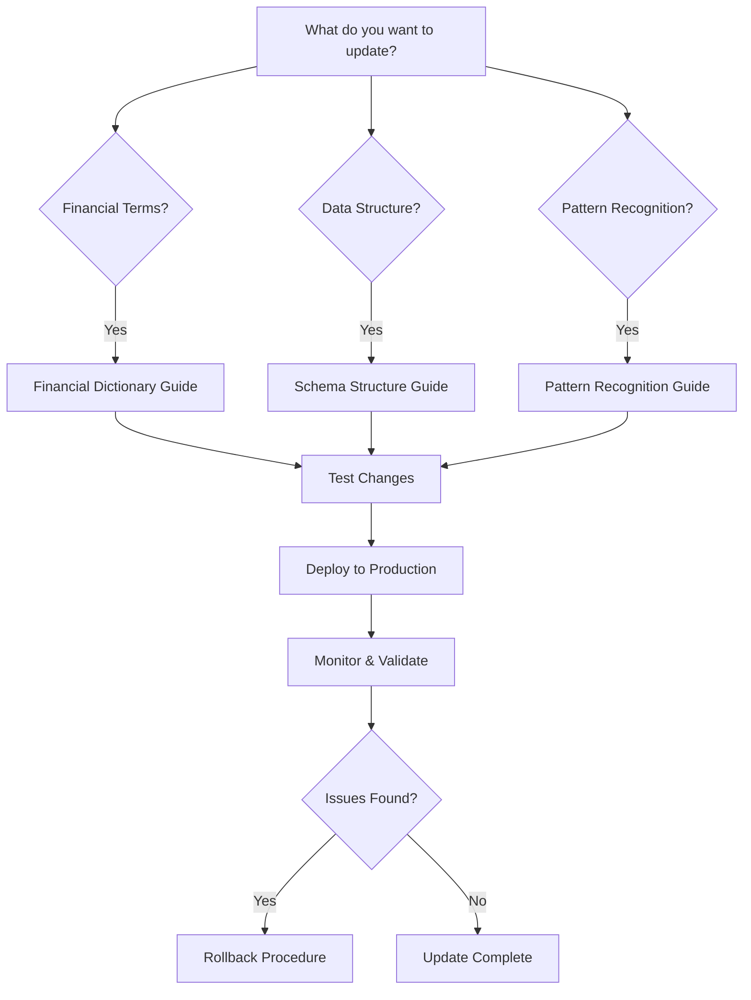

# FinDocPipeline Manual Schema & Financial Dictionary Update Guide

## 🎯 Quick Access

| Update Type | Guide | Common Use Cases |
|-------------|-------|------------------|
| **Financial Terms** | [Financial Dictionary Guide](FINANCIAL_DICTIONARY_UPDATE_GUIDE.md) | Adding ESG terms, crypto, regulatory terms |
| **Data Fields** | [Schema Structure Guide](SCHEMA_STRUCTURE_UPDATE_GUIDE.md) | New output fields, data types |
| **Pattern Recognition** | [Pattern Recognition Guide](PATTERN_RECOGNITION_UPDATE_GUIDE.md) | Improving metric extraction, new regex |
| **Testing** | [Testing & Validation Guide](TESTING_VALIDATION_GUIDE.md) | Pre-deployment validation |
| **Deployment** | [Deployment & Rollback Guide](DEPLOYMENT_ROLLBACK_GUIDE.md) | Production updates, rollback |

## 🏗️ System Architecture Overview

Your FinDocPipeline system has **two main components** for schema and dictionary management:

### 1. **Live Production System**
- **File**: [`FinDocPipeline.py`](FinDocPipeline.py)
- **URL**: `http://localhost:8501` (default Streamlit port)
- **Status**: ✅ Currently running (multiple instances)

### 2. **Reference Schema Documentation**
- **File**: [`complete_system_schema_export.json`](complete_system_schema_export.json)
- **Purpose**: Comprehensive schema documentation and validation reference

## 📍 Key Update Locations in FinDocPipeline.py



## 🔄 Update Workflow Decision Tree



## 🚀 Quick Start Procedures

### For Adding New Financial Terms
1. **Navigate to**: [Financial Dictionary Guide](FINANCIAL_DICTIONARY_UPDATE_GUIDE.md)
2. **Update locations**: 3-4 code sections in [`FinDocPipeline.py`](FinDocPipeline.py)
3. **Test**: Use sample documents with new terms
4. **Deploy**: Restart Streamlit application

### For Adding New Data Fields
1. **Navigate to**: [Schema Structure Guide](SCHEMA_STRUCTURE_UPDATE_GUIDE.md)
2. **Update locations**: Schema definitions + reference JSON
3. **Test**: Validate output structure
4. **Deploy**: Update production code

### For Improving Pattern Recognition
1. **Navigate to**: [Pattern Recognition Guide](PATTERN_RECOGNITION_UPDATE_GUIDE.md)
2. **Update locations**: Regex patterns in metrics extractors
3. **Test**: Validate against sample financial documents
4. **Deploy**: Monitor extraction accuracy

## ⚠️ Critical Safety Procedures

### Before Making Any Changes
- [ ] **Backup current [`FinDocPipeline.py`](FinDocPipeline.py)**
- [ ] **Document current system state**
- [ ] **Prepare rollback plan**
- [ ] **Test in development environment first**

### Emergency Contacts & Procedures
- **Rollback Guide**: [Deployment & Rollback Guide](DEPLOYMENT_ROLLBACK_GUIDE.md)
- **System Status**: Check running terminals in VS Code
- **Backup Location**: Create backup before changes

## 📊 Current System Status

### Active Streamlit Instances
```
Main Application:     streamlit run FinDocPipeline.py
Enhanced Sandbox:     Multiple instances on ports 8504-8511
```

### Key Files to Monitor
- **Primary**: [`FinDocPipeline.py`](FinDocPipeline.py) (1,511 lines)
- **Schema Reference**: [`complete_system_schema_export.json`](complete_system_schema_export.json) (1,113 lines)
- **Configuration**: [`.streamlit/config.toml`](.streamlit/config.toml)

## 🔍 Understanding Your Current Schema

### Financial Dictionary Components
1. **Basic Financial Terms** (12 terms): Revenue, profit, earnings, etc.
2. **NLP Financial Labels** (18 terms): Extended financial vocabulary
3. **Metrics Patterns** (12 categories): Regex patterns for data extraction

### Schema Structure Components
1. **Page Data Schema**: Core document processing structure
2. **NLP Dataset Schema**: Text analysis and classification
3. **Visual Content Schema**: Charts, tables, and image analysis

### Pattern Recognition Components
1. **Financial Data Patterns**: Basic revenue/profit extraction
2. **Enhanced Metrics Patterns**: Comprehensive financial metrics
3. **Chart Detection**: Visual content identification

## 📚 Detailed Guides

### [📖 Financial Dictionary Update Guide](FINANCIAL_DICTIONARY_UPDATE_GUIDE.md)
Complete procedures for updating financial terminology, adding new term categories, and managing the financial vocabulary used throughout the system.

### [📖 Schema Structure Update Guide](SCHEMA_STRUCTURE_UPDATE_GUIDE.md)
Step-by-step instructions for modifying data structures, adding new fields, and maintaining backward compatibility.

### [📖 Pattern Recognition Update Guide](PATTERN_RECOGNITION_UPDATE_GUIDE.md)
Advanced guide for updating regex patterns, improving financial data extraction, and enhancing chart detection capabilities.

### [📖 Testing & Validation Guide](TESTING_VALIDATION_GUIDE.md)
Comprehensive testing procedures to validate changes before production deployment.

### [📖 Deployment & Rollback Guide](DEPLOYMENT_ROLLBACK_GUIDE.md)
Production deployment procedures, monitoring guidelines, and emergency rollback protocols.

## 🎯 Common Update Scenarios

### Scenario 1: Adding ESG (Environmental, Social, Governance) Terms
- **Guide**: [Financial Dictionary Guide](FINANCIAL_DICTIONARY_UPDATE_GUIDE.md) → Section 2.1
- **Locations**: 3 code sections
- **Testing**: ESG document samples
- **Timeline**: 15-30 minutes

### Scenario 2: Adding Cryptocurrency Financial Terms
- **Guide**: [Financial Dictionary Guide](FINANCIAL_DICTIONARY_UPDATE_GUIDE.md) → Section 2.2
- **Locations**: 4 code sections + patterns
- **Testing**: Crypto financial reports
- **Timeline**: 30-45 minutes

### Scenario 3: Adding New Output Data Fields
- **Guide**: [Schema Structure Guide](SCHEMA_STRUCTURE_UPDATE_GUIDE.md) → Section 3.1
- **Locations**: Schema definitions + JSON reference
- **Testing**: Output structure validation
- **Timeline**: 45-60 minutes

### Scenario 4: Improving Financial Metrics Extraction
- **Guide**: [Pattern Recognition Guide](PATTERN_RECOGNITION_UPDATE_GUIDE.md) → Section 4.1
- **Locations**: Regex patterns in metrics extractor
- **Testing**: Financial document accuracy testing
- **Timeline**: 60-90 minutes

## 📞 Support & Troubleshooting

### Common Issues
1. **Streamlit won't restart**: Check terminal for error messages
2. **New terms not detected**: Verify case sensitivity and regex patterns
3. **Schema validation errors**: Check field types and required fields
4. **Performance degradation**: Review pattern complexity and test data size

### Getting Help
- **Error Logs**: Check VS Code terminal output
- **Validation**: Use built-in testing procedures in each guide
- **Rollback**: Follow emergency procedures in deployment guide

---

## 📝 Version Control

**Last Updated**: January 6, 2025  
**System Version**: FinDocPipeline v2.0.0  
**Schema Version**: 2.0.0  

**Change Log**:
- Initial comprehensive update guide creation
- Integrated with existing system architecture
- Added emergency procedures and rollback protocols