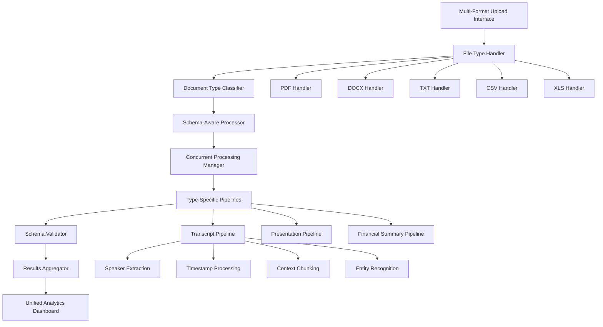

# 🏗️ FinDocPipeline Multi-Document Architecture Plan

## 📋 **Requirements Summary**
- **File Formats**: PDF, DOCX, TXT, CSV, XLS/XLSX
- **Concurrent Processing**: Up to 50 documents simultaneously
- **Document Types**: Transcript, Presentation, Financial Summary
- **Advanced Schema**: Type-specific data structures with rich metadata

---

## 🎯 **Enhanced Architecture Overview**



---

## 📊 **Document Type Schemas**

### **1. Transcript Schema**
```python
TranscriptSchema = {
    "document_metadata": {
        "document_id": str,
        "file_name": str,
        "file_type": str,
        "processing_timestamp": datetime,
        "quarter": str,  # "Q1 2024", "Q2 2024", etc.
        "bank_name": str,
        "company_ticker": str,
        "call_date": datetime,
        "call_type": str  # "earnings", "investor_day", "conference"
    },
    "speakers": [
        {
            "speaker_id": str,
            "speaker_name": str,
            "speaker_role": str,  # "CEO", "CFO", "Analyst", "Moderator"
            "company": str,
            "total_speaking_time": float,
            "segment_count": int
        }
    ],
    "segments": [
        {
            "segment_id": str,
            "speaker_id": str,
            "timestamp": str,  # "00:15:30" or extracted time
            "sequence_number": int,
            "content": str,
            "content_type": str,  # "prepared_remarks", "qa", "opening", "closing"
            "topic_classification": str,  # "financial_performance", "guidance", "strategy"
            "sentiment": str,  # "positive", "negative", "neutral"
            "key_metrics_mentioned": [str],
            "forward_looking": bool,
            "chunk_embedding": [float]  # For semantic search
        }
    ],
    "qa_pairs": [
        {
            "question_id": str,
            "analyst_name": str,
            "analyst_firm": str,
            "question_text": str,
            "question_topic": str,
            "responder_name": str,
            "response_text": str,
            "question_timestamp": str,
            "response_timestamp": str
        }
    ],
    "financial_mentions": [
        {
            "metric_name": str,
            "value": float,
            "unit": str,
            "period": str,
            "context": str,
            "speaker_id": str,
            "confidence_score": float
        }
    ],
    "topics": [
        {
            "topic_name": str,
            "topic_category": str,  # "performance", "outlook", "strategy", "risk"
            "mentions_count": int,
            "speakers_involved": [str],
            "sentiment_distribution": dict,
            "key_phrases": [str]
        }
    ]
}
```

### **2. Presentation Schema**
```python
PresentationSchema = {
    "document_metadata": {
        "document_id": str,
        "file_name": str,
        "file_type": str,
        "processing_timestamp": datetime,
        "presentation_type": str,  # "earnings", "investor", "conference"
        "company_name": str,
        "company_ticker": str,
        "presentation_date": datetime,
        "total_slides": int
    },
    "slides": [
        {
            "slide_id": str,
            "slide_number": int,
            "slide_title": str,
            "slide_type": str,  # "title", "agenda", "financial", "chart", "summary"
            "content_text": str,
            "bullet_points": [str],
            "has_charts": bool,
            "has_tables": bool,
            "chart_types": [str],  # "bar", "line", "pie", "waterfall"
            "financial_data": [dict],
            "key_messages": [str]
        }
    ],
    "charts_and_visuals": [
        {
            "visual_id": str,
            "slide_id": str,
            "visual_type": str,
            "title": str,
            "data_extracted": dict,
            "ocr_text": str,
            "metrics_identified": [str]
        }
    ],
    "financial_highlights": [
        {
            "metric_name": str,
            "current_value": float,
            "previous_value": float,
            "change_percent": float,
            "slide_reference": str,
            "context": str
        }
    ]
}
```

### **3. Financial Summary Schema**
```python
FinancialSummarySchema = {
    "document_metadata": {
        "document_id": str,
        "file_name": str,
        "file_type": str,
        "processing_timestamp": datetime,
        "report_type": str,  # "quarterly", "annual", "interim"
        "company_name": str,
        "company_ticker": str,
        "reporting_period": str,
        "currency": str
    },
    "financial_statements": [
        {
            "statement_type": str,  # "income", "balance_sheet", "cash_flow"
            "line_items": [
                {
                    "item_name": str,
                    "current_period": float,
                    "previous_period": float,
                    "change_amount": float,
                    "change_percent": float,
                    "item_category": str
                }
            ]
        }
    ],
    "key_ratios": [
        {
            "ratio_name": str,
            "ratio_category": str,  # "profitability", "liquidity", "efficiency"
            "current_value": float,
            "benchmark_value": float,
            "industry_average": float,
            "calculation_method": str
        }
    ],
    "narrative_sections": [
        {
            "section_title": str,
            "section_type": str,  # "executive_summary", "outlook", "risks"
            "content": str,
            "key_points": [str],
            "sentiment": str,
            "forward_looking_statements": [str]
        }
    ]
}
```

---

## 🔧 **Implementation Components**

### **1. Multi-Format File Handlers**
```python
class UniversalFileHandler:
    """Handle multiple file formats with type-specific processing"""
    
    def __init__(self):
        self.handlers = {
            'pdf': PDFHandler(),
            'docx': DOCXHandler(),
            'txt': TXTHandler(),
            'csv': CSVHandler(),
            'xlsx': XLSHandler(),
            'xls': XLSHandler()
        }
    
    def process_file(self, file_path: str, file_type: str) -> dict:
        handler = self.handlers.get(file_type.lower())
        if not handler:
            raise UnsupportedFileTypeError(f"File type {file_type} not supported")
        return handler.extract_content(file_path)

class DOCXHandler:
    """Microsoft Word document processing"""
    def extract_content(self, file_path: str) -> dict:
        # Extract text, tables, headers, metadata
        pass

class CSVHandler:
    """CSV file processing for structured financial data"""
    def extract_content(self, file_path: str) -> dict:
        # Parse CSV, detect financial data patterns
        pass

class XLSHandler:
    """Excel file processing for financial statements"""
    def extract_content(self, file_path: str) -> dict:
        # Extract worksheets, formulas, charts
        pass
```

### **2. Advanced Document Classifier**
```python
class AdvancedDocumentClassifier:
    """AI-powered document type classification"""
    
    def __init__(self):
        self.transcript_patterns = self._load_transcript_patterns()
        self.presentation_patterns = self._load_presentation_patterns()
        self.summary_patterns = self._load_summary_patterns()
    
    def classify_document(self, content: dict, metadata: dict) -> str:
        scores = {
            'transcript': self._score_transcript(content),
            'presentation': self._score_presentation(content),
            'financial_summary': self._score_financial_summary(content)
        }
        return max(scores, key=scores.get)
    
    def _score_transcript(self, content: dict) -> float:
        # Look for speaker patterns, Q&A structure, timestamps
        indicators = [
            self._has_speaker_labels(content['text']),
            self._has_qa_structure(content['text']),
            self._has_call_metadata(content['text']),
            self._has_conversational_patterns(content['text'])
        ]
        return sum(indicators) / len(indicators)
```

### **3. Transcript-Specific Processing**
```python
class TranscriptProcessor:
    """Specialized processing for earnings call transcripts"""
    
    def __init__(self):
        self.speaker_extractor = SpeakerExtractor()
        self.timestamp_parser = TimestampParser()
        self.topic_classifier = TopicClassifier()
        self.entity_recognizer = FinancialEntityRecognizer()
    
    def process_transcript(self, content: str, metadata: dict) -> dict:
        # Extract company and quarter information
        company_info = self._extract_company_info(content, metadata)
        
        # Identify and extract speakers
        speakers = self.speaker_extractor.extract_speakers(content)
        
        # Segment content by speaker and timestamp
        segments = self._segment_content(content, speakers)
        
        # Classify topics and extract Q&A pairs
        qa_pairs = self._extract_qa_pairs(segments)
        topics = self.topic_classifier.classify_topics(segments)
        
        # Extract financial mentions
        financial_mentions = self.entity_recognizer.extract_financial_data(segments)
        
        return {
            'document_metadata': company_info,
            'speakers': speakers,
            'segments': segments,
            'qa_pairs': qa_pairs,
            'topics': topics,
            'financial_mentions': financial_mentions
        }

class SpeakerExtractor:
    """Extract and identify speakers from transcript text"""
    
    def extract_speakers(self, content: str) -> List[dict]:
        # Identify speaker patterns: "John Smith - CEO:", "Analyst:", etc.
        # Extract roles, companies, speaking time
        pass

class TopicClassifier:
    """Classify discussion topics and themes"""
    
    def __init__(self):
        self.topic_categories = {
            'financial_performance': ['revenue', 'profit', 'earnings', 'growth'],
            'guidance': ['outlook', 'forecast', 'expect', 'guidance'],
            'strategy': ['strategy', 'initiative', 'plan', 'focus'],
            'risk_factors': ['risk', 'challenge', 'concern', 'uncertainty']
        }
    
    def classify_topics(self, segments: List[dict]) -> List[dict]:
        # Analyze content for topic classification
        pass
```

### **4. Concurrent Processing Manager**
```python
class ConcurrentDocumentProcessor:
    """Manage concurrent processing with progress tracking"""
    
    def __init__(self, max_workers: int = 50):
        self.max_workers = max_workers
        self.processing_queue = Queue()
        self.results_store = {}
        self.progress_tracker = ProgressTracker()
    
    async def process_document_batch(self, documents: List[Document]) -> Dict:
        """Process multiple documents concurrently"""
        
        # Initialize progress tracking
        self.progress_tracker.initialize(len(documents))
        
        # Create processing tasks
        tasks = []
        for doc in documents:
            task = asyncio.create_task(self._process_single_document(doc))
            tasks.append(task)
        
        # Execute with progress updates
        results = []
        for completed_task in asyncio.as_completed(tasks):
            result = await completed_task
            results.append(result)
            self.progress_tracker.update_progress(result['document_id'])
        
        return self._aggregate_results(results)
    
    async def _process_single_document(self, document: Document) -> dict:
        """Process individual document with type-specific pipeline"""
        
        try:
            # Extract content based on file type
            content = self.file_handler.process_file(document.path, document.type)
            
            # Classify document type
            doc_type = self.classifier.classify_document(content, document.metadata)
            
            # Apply type-specific processing
            if doc_type == 'transcript':
                result = self.transcript_processor.process_transcript(content['text'], document.metadata)
            elif doc_type == 'presentation':
                result = self.presentation_processor.process_presentation(content, document.metadata)
            elif doc_type == 'financial_summary':
                result = self.summary_processor.process_summary(content, document.metadata)
            
            # Validate against schema
            validated_result = self.schema_validator.validate(result, doc_type)
            
            return {
                'document_id': document.id,
                'document_type': doc_type,
                'processing_status': 'success',
                'data': validated_result,
                'processing_time': time.time() - document.start_time
            }
            
        except Exception as e:
            return {
                'document_id': document.id,
                'processing_status': 'error',
                'error_message': str(e),
                'processing_time': time.time() - document.start_time
            }
```

---

## 🎨 **Enhanced User Interface**

### **Multi-Format Upload Interface**
```python
def render_enhanced_upload_interface():
    st.header("📁 Upload Financial Documents (Up to 50 files)")
    
    # Multi-format file uploader
    uploaded_files = st.file_uploader(
        "Choose files",
        type=['pdf', 'docx', 'txt', 'csv', 'xlsx', 'xls'],
        accept_multiple_files=True,
        help="Upload earnings transcripts, presentations, financial summaries, and data files"
    )
    
    if uploaded_files:
        # Document preview and classification
        st.subheader("📋 Document Queue")
        
        for i, file in enumerate(uploaded_files):
            col1, col2, col3, col4 = st.columns([3, 2, 2, 1])
            
            with col1:
                st.write(f"📄 {file.name}")
            with col2:
                # Auto-detect document type
                doc_type = classify_document_preview(file)
                st.badge(doc_type, type="secondary")
            with col3:
                st.write(f"{file.size / 1024:.1f} KB")
            with col4:
                if st.button("🗑️", key=f"remove_{i}"):
                    # Remove file from queue
                    pass
        
        # Processing configuration
        st.subheader("⚙️ Processing Configuration")
        
        col1, col2 = st.columns(2)
        with col1:
            concurrent_workers = st.slider("Concurrent Workers", 1, 50, 25)
        with col2:
            priority_processing = st.selectbox(
                "Priority Processing",
                ["None", "Transcripts First", "Financial Summaries First"]
            )
        
        # Start processing button
        if st.button("🚀 Start Batch Processing", type="primary"):
            process_document_batch(uploaded_files, concurrent_workers)
```

### **Real-Time Processing Dashboard**
```python
def render_processing_dashboard(processing_status: dict):
    st.header("🚀 Concurrent Processing Status")
    
    # Overall progress
    overall_progress = processing_status['completed'] / processing_status['total']
    st.progress(overall_progress)
    st.write(f"Overall Progress: {processing_status['completed']}/{processing_status['total']} documents ({overall_progress:.1%})")
    
    # Type-specific progress
    col1, col2, col3 = st.columns(3)
    
    with col1:
        st.metric(
            "📋 Transcripts",
            f"{processing_status['transcripts']['completed']}/{processing_status['transcripts']['total']}",
            f"{processing_status['transcripts']['progress']:.1%}"
        )
    
    with col2:
        st.metric(
            "📊 Presentations", 
            f"{processing_status['presentations']['completed']}/{processing_status['presentations']['total']}",
            f"{processing_status['presentations']['progress']:.1%}"
        )
    
    with col3:
        st.metric(
            "📈 Summaries",
            f"{processing_status['summaries']['completed']}/{processing_status['summaries']['total']}",
            f"{processing_status['summaries']['progress']:.1%}"
        )
    
    # Active processing details
    st.subheader("⚡ Active Processing")
    
    for worker_id, task in processing_status['active_tasks'].items():
        col1, col2, col3 = st.columns([2, 2, 1])
        with col1:
            st.write(f"Worker {worker_id}: {task['document_name']}")
        with col2:
            st.write(f"Type: {task['document_type']}")
        with col3:
            st.write(f"{task['elapsed_time']:.1f}s")
```

---

## 📊 **Cross-Document Analytics**

### **Unified Analytics Dashboard**
```python
class CrossDocumentAnalytics:
    """Advanced analytics across multiple processed documents"""
    
    def generate_unified_dashboard(self, processed_documents: List[dict]) -> dict:
        return {
            'document_summary': self._generate_document_summary(processed_documents),
            'financial_trends': self._analyze_financial_trends(processed_documents),
            'topic_analysis': self._perform_topic_analysis(processed_documents),
            'speaker_insights': self._analyze_speaker_patterns(processed_documents),
            'comparative_metrics': self._generate_comparative_metrics(processed_documents)
        }
    
    def _analyze_financial_trends(self, documents: List[dict]) -> dict:
        """Analyze financial trends across documents"""
        # Compare metrics across quarters, companies, document types
        pass
    
    def _perform_topic_analysis(self, documents: List[dict]) -> dict:
        """Cross-document topic analysis"""
        # Identify common themes, sentiment trends
        pass
    
    def _analyze_speaker_patterns(self, documents: List[dict]) -> dict:
        """Analyze speaker patterns across transcripts"""
        # CEO communication styles, analyst focus areas
        pass
```

---

## 🛡️ **Error Handling & Validation**

### **Schema Validation**
```python
class SchemaValidator:
    """Validate processed documents against type-specific schemas"""
    
    def __init__(self):
        self.schemas = {
            'transcript': TranscriptSchema,
            'presentation': PresentationSchema,
            'financial_summary': FinancialSummarySchema
        }
    
    def validate(self, data: dict, document_type: str) -> dict:
        schema = self.schemas.get(document_type)
        if not schema:
            raise ValidationError(f"No schema defined for {document_type}")
        
        # Validate data structure
        validated_data = self._validate_structure(data, schema)
        
        # Perform business logic validation
        validated_data = self._validate_business_rules(validated_data, document_type)
        
        return validated_data
```

---

## 📈 **Performance Optimization**

### **Memory Management**
- Streaming processing for large files
- Lazy loading of document content
- Efficient data structures for concurrent processing
- Garbage collection optimization

### **Processing Efficiency**
- Document chunking for parallel processing
- Caching of classification models
- Progressive result updates
- Resource pooling for file handlers

---

This architecture provides a comprehensive solution for multi-format, concurrent document processing with sophisticated schema design tailored to each document type. The system can handle the complexity of financial document analysis while maintaining performance and scalability.