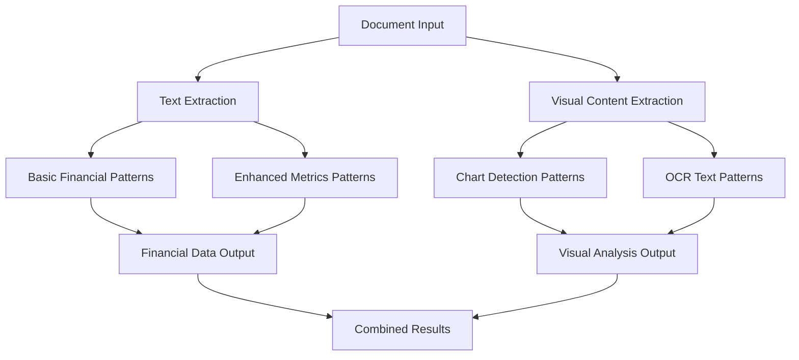

# Pattern Recognition Update Guide

## 📋 Overview

This guide provides comprehensive instructions for updating pattern recognition capabilities in your FinDocPipeline system. Pattern recognition controls how financial data, metrics, and visual content are identified and extracted from documents.

## 🎯 Quick Reference

| Pattern Type | Location | Lines | Complexity | Impact |
|-------------|----------|-------|------------|--------|
| **Basic Financial Patterns** | [`ComprehensiveFinancialParser._extract_financial_data()`](FinDocPipeline.py:155) | 160-177 | 🟢 Low | 🟡 Medium |
| **Enhanced Metrics Patterns** | [`DeduplicatedMetricsExtractor.__init__()`](FinDocPipeline.py:806) | 807-846 | 🟡 Medium | 🔴 High |
| **Chart Detection Patterns** | [`ComprehensiveFinancialParser._detect_chart_elements()`](FinDocPipeline.py:187) | 194-198 | 🟢 Low | 🟢 Low |
| **Visual Content Patterns** | [`EnhancedVisualParser._cv_chart_detection()`](FinDocPipeline.py:643) | 648-672 | 🔴 High | 🟡 Medium |

## 🔍 Understanding Pattern Recognition Architecture

### Pattern Recognition Flow


### Current Pattern Categories

#### 1. **Basic Financial Patterns** (Simple Regex)
- **Revenue patterns**: `revenue[:\s]+[\$£€]?([\d,\.]+)`
- **Profit patterns**: `profit[:\s]+[\$£€]?([\d,\.]+)`
- **Purpose**: Quick financial data identification

#### 2. **Enhanced Metrics Patterns** (Complex Regex)
- **12 metric categories**: Revenue, net income, assets, equity, etc.
- **Multiple patterns per metric**: Different formats and variations
- **Purpose**: Comprehensive financial data extraction

#### 3. **Chart Detection Patterns** (Keyword-based)
- **Visual indicators**: Chart, graph, figure, exhibit, table
- **Purpose**: Identify pages with visual content

#### 4. **Visual Content Patterns** (Computer Vision)
- **Edge detection**: Line and shape identification
- **OCR patterns**: Text extraction from images
- **Purpose**: Analyze charts and visual elements

## 📝 Step-by-Step Update Procedures

### Procedure 1: Updating Basic Financial Patterns

#### When to Use
- Quick fixes to basic pattern recognition
- Adding simple new financial terms
- Improving basic data extraction

#### Steps

1. **Navigate to Basic Patterns** (line 160 in [`FinDocPipeline.py`](FinDocPipeline.py))

2. **Current Revenue Patterns**:
```python
revenue_patterns = [
    r'revenue[:\s]+[\$£€]?([\d,\.]+)\s*(million|billion|m|b)?',
    r'total revenue[:\s]+[\$£€]?([\d,\.]+)\s*(million|billion|m|b)?',
    r'net revenue[:\s]+[\$£€]?([\d,\.]+)\s*(million|billion|m|b)?'
]
```

3. **Enhanced Revenue Patterns**:
```python
revenue_patterns = [
    # Existing patterns
    r'revenue[:\s]+[\$£€]?([\d,\.]+)\s*(million|billion|m|b|k)?',
    r'total revenue[:\s]+[\$£€]?([\d,\.]+)\s*(million|billion|m|b|k)?',
    r'net revenue[:\s]+[\$£€]?([\d,\.]+)\s*(million|billion|m|b|k)?',
    
    # New patterns for better coverage
    r'gross revenue[:\s]+[\$£€]?([\d,\.]+)\s*(million|billion|m|b|k)?',
    r'operating revenue[:\s]+[\$£€]?([\d,\.]+)\s*(million|billion|m|b|k)?',
    r'annual revenue[:\s]+[\$£€]?([\d,\.]+)\s*(million|billion|m|b|k)?',
    r'quarterly revenue[:\s]+[\$£€]?([\d,\.]+)\s*(million|billion|m|b|k)?',
    
    # Alternative formats
    r'revenue\s*[:=]\s*[\$£€]?([\d,\.]+)\s*(million|billion|m|b|k)?',
    r'revenue\s+of\s+[\$£€]?([\d,\.]+)\s*(million|billion|m|b|k)?',
    r'revenue\s+was\s+[\$£€]?([\d,\.]+)\s*(million|billion|m|b|k)?',
    
    # International formats
    r'revenue[:\s]+€([\d,\.]+)\s*(million|billion|m|b|k)?',
    r'revenue[:\s]+£([\d,\.]+)\s*(million|billion|m|b|k)?',
    r'revenue[:\s]+¥([\d,\.]+)\s*(million|billion|m|b|k)?'
]
```

4. **Enhanced Profit Patterns** (line 173):
```python
profit_patterns = [
    # Existing patterns
    r'net income[:\s]+[\$£€]?([\d,\.]+)\s*(million|billion|m|b|k)?',
    r'profit[:\s]+[\$£€]?([\d,\.]+)\s*(million|billion|m|b|k)?',
    r'earnings[:\s]+[\$£€]?([\d,\.]+)\s*(million|billion|m|b|k)?',
    
    # Enhanced patterns
    r'operating profit[:\s]+[\$£€]?([\d,\.]+)\s*(million|billion|m|b|k)?',
    r'gross profit[:\s]+[\$£€]?([\d,\.]+)\s*(million|billion|m|b|k)?',
    r'pre-tax profit[:\s]+[\$£€]?([\d,\.]+)\s*(million|billion|m|b|k)?',
    r'after-tax profit[:\s]+[\$£€]?([\d,\.]+)\s*(million|billion|m|b|k)?',
    
    # EBITDA patterns
    r'ebitda[:\s]+[\$£€]?([\d,\.]+)\s*(million|billion|m|b|k)?',
    r'adjusted ebitda[:\s]+[\$£€]?([\d,\.]+)\s*(million|billion|m|b|k)?',
    
    # Loss patterns
    r'net loss[:\s]+[\$£€]?([\d,\.]+)\s*(million|billion|m|b|k)?',
    r'operating loss[:\s]+[\$£€]?([\d,\.]+)\s*(million|billion|m|b|k)?'
]
```

### Procedure 2: Updating Enhanced Metrics Patterns

#### When to Use
- Adding new financial metrics
- Improving extraction accuracy
- Supporting new financial statement formats

#### Steps

1. **Navigate to Enhanced Patterns** (line 807 in [`FinDocPipeline.py`](FinDocPipeline.py))

2. **Current Pattern Structure**:
```python
self.metric_patterns = {
    'revenue': [
        r'(?:total\s+)?revenue[:\s]+[\$£€]?([\d,\.]+)\s*(million|billion|m|b|k)?',
        r'(?:net\s+)?sales[:\s]+[\$£€]?([\d,\.]+)\s*(million|billion|m|b|k)?'
    ],
    # ... other metrics
}
```

3. **Add New Metric Categories**:
```python
self.metric_patterns = {
    # Existing metrics...
    'revenue': [...],
    'net_income': [...],
    
    # NEW: ESG Metrics
    'carbon_emissions': [
        r'carbon\s+emissions[:\s]+([\d,\.]+)\s*(tons?|tonnes?|mt|kt|co2e)?',
        r'co2\s+emissions[:\s]+([\d,\.]+)\s*(tons?|tonnes?|mt|kt)?',
        r'greenhouse\s+gas\s+emissions[:\s]+([\d,\.]+)\s*(tons?|tonnes?|mt|kt)?',
        r'scope\s+[123]\s+emissions[:\s]+([\d,\.]+)\s*(tons?|tonnes?|mt|kt)?'
    ],
    
    'renewable_energy': [
        r'renewable\s+energy[:\s]+([\d,\.]+)%?',
        r'clean\s+energy[:\s]+([\d,\.]+)%?',
        r'solar\s+energy[:\s]+([\d,\.]+)\s*(mw|gw|kwh|mwh)?',
        r'wind\s+energy[:\s]+([\d,\.]+)\s*(mw|gw|kwh|mwh)?'
    ],
    
    'esg_score': [
        r'esg\s+score[:\s]+([\d,\.]+)',
        r'sustainability\s+score[:\s]+([\d,\.]+)',
        r'environmental\s+score[:\s]+([\d,\.]+)',
        r'governance\s+score[:\s]+([\d,\.]+)'
    ],
    
    # NEW: Cryptocurrency Metrics
    'bitcoin_holdings': [
        r'bitcoin\s+holdings?[:\s]+([\d,\.]+)\s*(btc)?',
        r'btc\s+holdings?[:\s]+([\d,\.]+)',
        r'bitcoin\s+reserves?[:\s]+([\d,\.]+)\s*(btc)?'
    ],
    
    'crypto_revenue': [
        r'crypto(?:currency)?\s+revenue[:\s]+[\$£€]?([\d,\.]+)\s*(million|billion|m|b|k)?',
        r'digital\s+asset\s+revenue[:\s]+[\$£€]?([\d,\.]+)\s*(million|billion|m|b|k)?',
        r'blockchain\s+revenue[:\s]+[\$£€]?([\d,\.]+)\s*(million|billion|m|b|k)?'
    ],
    
    # NEW: Banking-Specific Metrics
    'tier1_capital_ratio': [
        r'tier\s+1\s+capital\s+ratio[:\s]+([\d,\.]+)%?',
        r'tier\s+1\s+ratio[:\s]+([\d,\.]+)%?',
        r'cet1\s+ratio[:\s]+([\d,\.]+)%?'
    ],
    
    'net_interest_margin': [
        r'net\s+interest\s+margin[:\s]+([\d,\.]+)%?',
        r'nim[:\s]+([\d,\.]+)%?'
    ],
    
    'loan_loss_provision': [
        r'loan\s+loss\s+provision[:\s]+[\$£€]?([\d,\.]+)\s*(million|billion|m|b|k)?',
        r'credit\s+loss\s+provision[:\s]+[\$£€]?([\d,\.]+)\s*(million|billion|m|b|k)?',
        r'allowance\s+for\s+credit\s+losses[:\s]+[\$£€]?([\d,\.]+)\s*(million|billion|m|b|k)?'
    ],
    
    # NEW: Technology Metrics
    'cloud_revenue': [
        r'cloud\s+revenue[:\s]+[\$£€]?([\d,\.]+)\s*(million|billion|m|b|k)?',
        r'saas\s+revenue[:\s]+[\$£€]?([\d,\.]+)\s*(million|billion|m|b|k)?',
        r'subscription\s+revenue[:\s]+[\$£€]?([\d,\.]+)\s*(million|billion|m|b|k)?'
    ],
    
    'monthly_active_users': [
        r'monthly\s+active\s+users[:\s]+([\d,\.]+)\s*(million|billion|m|b|k)?',
        r'mau[:\s]+([\d,\.]+)\s*(million|billion|m|b|k)?'
    ]
}
```

### Procedure 3: Advanced Pattern Techniques

#### Complex Pattern Examples

1. **Multi-Currency Support**:
```python
'revenue_multicurrency': [
    r'revenue[:\s]+(?:USD\s+)?[\$]([\d,\.]+)\s*(million|billion|m|b|k)?',
    r'revenue[:\s]+(?:EUR\s+)?[€]([\d,\.]+)\s*(million|billion|m|b|k)?',
    r'revenue[:\s]+(?:GBP\s+)?[£]([\d,\.]+)\s*(million|billion|m|b|k)?',
    r'revenue[:\s]+(?:JPY\s+)?[¥]([\d,\.]+)\s*(million|billion|m|b|k)?'
]
```

2. **Time Period Specific Patterns**:
```python
'quarterly_revenue': [
    r'q[1-4]\s+revenue[:\s]+[\$£€]?([\d,\.]+)\s*(million|billion|m|b|k)?',
    r'(?:first|second|third|fourth)\s+quarter\s+revenue[:\s]+[\$£€]?([\d,\.]+)',
    r'revenue\s+for\s+the\s+quarter[:\s]+[\$£€]?([\d,\.]+)'
]
```

3. **Percentage and Ratio Patterns**:
```python
'growth_rates': [
    r'revenue\s+growth[:\s]+([\d,\.]+)%',
    r'(?:yoy|year[- ]over[- ]year)\s+growth[:\s]+([\d,\.]+)%',
    r'organic\s+growth[:\s]+([\d,\.]+)%'
]
```

4. **Negative Value Patterns**:
```python
'losses': [
    r'net\s+loss[:\s]+[\$£€]?\(?([\d,\.]+)\)?',
    r'operating\s+loss[:\s]+[\$£€]?\(?([\d,\.]+)\)?',
    r'loss\s+of[:\s]+[\$£€]?([\d,\.]+)'
]
```

### Procedure 4: Updating Chart Detection Patterns

#### When to Use
- Improving visual content identification
- Adding new chart types
- Enhancing chart classification

#### Steps

1. **Navigate to Chart Detection** (line 194 in [`FinDocPipeline.py`](FinDocPipeline.py))

2. **Current Chart Keywords**:
```python
chart_keywords = ['chart', 'graph', 'figure', 'exhibit', 'table', 'diagram']
```

3. **Enhanced Chart Detection**:
```python
def _detect_chart_elements(self, text):
    """Detect chart and visualization indicators"""
    indicators = []
    
    if not isinstance(text, str):
        text = str(text) if text is not None else ""
    
    # Enhanced chart keywords with categories
    chart_patterns = {
        'bar_chart': ['bar chart', 'bar graph', 'column chart', 'histogram'],
        'line_chart': ['line chart', 'line graph', 'trend line', 'time series'],
        'pie_chart': ['pie chart', 'pie graph', 'donut chart', 'circular chart'],
        'scatter_plot': ['scatter plot', 'scatter chart', 'correlation plot'],
        'table': ['table', 'matrix', 'grid', 'tabular data'],
        'diagram': ['diagram', 'flowchart', 'organizational chart', 'org chart'],
        'infographic': ['infographic', 'dashboard', 'scorecard'],
        'heatmap': ['heatmap', 'heat map', 'correlation matrix'],
        'waterfall': ['waterfall chart', 'bridge chart', 'variance chart'],
        'treemap': ['treemap', 'tree map', 'hierarchical chart']
    }
    
    text_lower = text.lower()
    
    for chart_type, keywords in chart_patterns.items():
        for keyword in keywords:
            if keyword in text_lower:
                indicators.append({
                    'type': chart_type,
                    'keyword': keyword,
                    'confidence': 0.8 if keyword == chart_type.replace('_', ' ') else 0.6
                })
    
    # Additional visual indicators
    visual_indicators = [
        'figure', 'exhibit', 'appendix', 'chart', 'graph', 'plot',
        'visualization', 'graphic', 'image', 'illustration'
    ]
    
    for indicator in visual_indicators:
        if indicator in text_lower:
            indicators.append({
                'type': 'visual_content',
                'keyword': indicator,
                'confidence': 0.5
            })
    
    return indicators
```

### Procedure 5: Creating Custom Pattern Validators

#### Pattern Testing Function
```python
def test_financial_patterns(self, test_text, patterns):
    """Test financial patterns against sample text"""
    results = []
    
    for pattern_name, pattern_list in patterns.items():
        for pattern in pattern_list:
            matches = list(re.finditer(pattern, test_text, re.IGNORECASE))
            
            for match in matches:
                results.append({
                    'pattern_name': pattern_name,
                    'pattern': pattern,
                    'match': match.group(0),
                    'value': match.group(1) if len(match.groups()) > 0 else None,
                    'unit': match.group(2) if len(match.groups()) > 1 else None,
                    'start_pos': match.start(),
                    'end_pos': match.end(),
                    'context': test_text[max(0, match.start()-20):match.end()+20]
                })
    
    return results

# Usage example
test_text = "Total revenue was $125.5 million, representing a 15% increase."
pattern_results = self.test_financial_patterns(test_text, self.metric_patterns)
```

## 🧪 Pattern Testing and Validation

### Testing Framework

#### 1. **Regex Pattern Tester**
```python
def validate_regex_pattern(pattern, test_cases):
    """Validate regex pattern against test cases"""
    results = []
    
    for test_case in test_cases:
        try:
            matches = re.findall(pattern, test_case['text'], re.IGNORECASE)
            results.append({
                'text': test_case['text'],
                'expected': test_case['expected'],
                'actual': matches,
                'passed': matches == test_case['expected']
            })
        except re.error as e:
            results.append({
                'text': test_case['text'],
                'error': str(e),
                'passed': False
            })
    
    return results

# Test cases example
revenue_test_cases = [
    {
        'text': 'Total revenue was $125.5 million',
        'expected': [('125.5', 'million')]
    },
    {
        'text': 'Revenue: €45.2 billion',
        'expected': [('45.2', 'billion')]
    },
    {
        'text': 'Q1 revenue of £12.3m',
        'expected': [('12.3', 'm')]
    }
]
```

#### 2. **Performance Testing**
```python
import time

def test_pattern_performance(patterns, test_documents):
    """Test pattern performance on large documents"""
    performance_results = {}
    
    for pattern_name, pattern_list in patterns.items():
        start_time = time.time()
        total_matches = 0
        
        for document in test_documents:
            for pattern in pattern_list:
                matches = re.findall(pattern, document, re.IGNORECASE)
                total_matches += len(matches)
        
        end_time = time.time()
        
        performance_results[pattern_name] = {
            'processing_time': end_time - start_time,
            'total_matches': total_matches,
            'avg_time_per_match': (end_time - start_time) / max(total_matches, 1)
        }
    
    return performance_results
```

### Common Pattern Issues and Solutions

#### Issue 1: Greedy Matching
```python
# Problem: Greedy matching captures too much
r'revenue[:\s]+[\$£€]?([\d,\.]+.*)'  # BAD - captures everything after number

# Solution: Specific ending
r'revenue[:\s]+[\$£€]?([\d,\.]+)\s*(million|billion|m|b|k)?'  # GOOD
```

#### Issue 2: Case Sensitivity
```python
# Problem: Missing matches due to case
r'Revenue[:\s]+[\$£€]?([\d,\.]+)'  # BAD - only matches "Revenue"

# Solution: Use re.IGNORECASE or flexible pattern
r'(?i)revenue[:\s]+[\$£€]?([\d,\.]+)'  # GOOD - case insensitive
```

#### Issue 3: Special Characters
```python
# Problem: Unescaped special characters
r'revenue[$£€]?([\d,\.]+)'  # BAD - $ has special meaning

# Solution: Escape special characters
r'revenue[\$£€]?([\d,\.]+)'  # GOOD - $ is escaped
```

## 🎯 Pattern Optimization Strategies

### 1. **Pattern Prioritization**
```python
# Order patterns by specificity (most specific first)
'revenue': [
    r'total\s+annual\s+revenue[:\s]+[\$£€]?([\d,\.]+)',  # Most specific
    r'total\s+revenue[:\s]+[\$£€]?([\d,\.]+)',           # Medium specific
    r'revenue[:\s]+[\$£€]?([\d,\.]+)'                    # Least specific
]
```

### 2. **Performance Optimization**
```python
# Use non-capturing groups for better performance
r'(?:total\s+)?revenue[:\s]+[\$£€]?([\d,\.]+)'  # Faster

# Instead of
r'(total\s+)?revenue[:\s]+[\$£€]?([\d,\.]+)'    # Slower
```

### 3. **Confidence Scoring**
```python
def calculate_pattern_confidence(match, context):
    """Calculate confidence score for pattern match"""
    confidence = 0.5  # Base confidence
    
    # Boost confidence for specific contexts
    if 'total' in context.lower():
        confidence += 0.2
    if 'annual' in context.lower():
        confidence += 0.1
    if 'million' in match or 'billion' in match:
        confidence += 0.1
    
    return min(confidence, 1.0)
```

## 📚 Related Guides

- **[Master Guide](MASTER_SCHEMA_UPDATE_GUIDE.md)**: Overview and navigation
- **[Financial Dictionary Guide](FINANCIAL_DICTIONARY_UPDATE_GUIDE.md)**: Term management
- **[Schema Structure Guide](SCHEMA_STRUCTURE_UPDATE_GUIDE.md)**: Data structure updates
- **[Testing Guide](TESTING_VALIDATION_GUIDE.md)**: Validation procedures

---

## 📝 Version Control

**Last Updated**: January 6, 2025  
**Compatible with**: FinDocPipeline v2.0.0  
**Guide Version**: 1.0.0