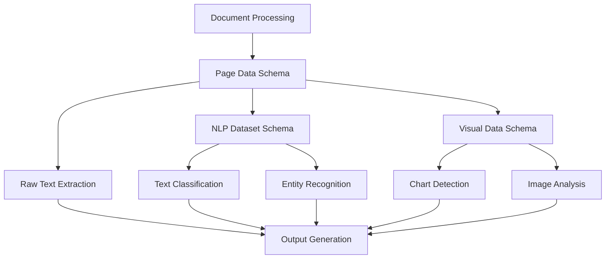

# Schema Structure Update Guide

## 📋 Overview

This guide provides detailed instructions for updating the data structure schemas in your FinDocPipeline system. Schema updates control the format and fields of output data, ensuring consistency and enabling new analytical capabilities.

## 🎯 Quick Reference

| Schema Type | Primary Location | Reference Documentation | Impact Level |
|-------------|------------------|------------------------|--------------|
| **Page Data Schema** | [`FinDocPipeline.py`](FinDocPipeline.py) lines 79-89 | [`complete_system_schema_export.json`](complete_system_schema_export.json) lines 17-66 | 🔴 High |
| **NLP Dataset Schema** | [`FinDocPipeline.py`](FinDocPipeline.py) lines 308-318 | [`complete_system_schema_export.json`](complete_system_schema_export.json) lines 67-245 | 🟡 Medium |
| **Visual Data Schema** | [`FinDocPipeline.py`](FinDocPipeline.py) lines 550-609 | [`complete_system_schema_export.json`](complete_system_schema_export.json) lines 246-300 | 🟢 Low |

## 🏗️ Understanding Schema Architecture

### Schema Hierarchy


### Current Schema Structure

#### 1. Page Data Schema (Core Document Structure)
**Purpose**: Raw document processing results  
**Location**: [`FinDocPipeline.py`](FinDocPipeline.py) lines 79-89

```python
page_data = {
    'page': page_num + 1,                    # Required: Page number
    'method': 'pdfplumber_comprehensive',    # Required: Extraction method
    'full_text': full_text,                  # Required: Complete text
    'word_count': len(full_text.split()),    # Required: Word count
    'char_count': len(full_text),            # Required: Character count
    'line_count': len(full_text.split('\n')), # Required: Line count
    'tables': [],                            # Optional: Table data
    'financial_metrics': {},                 # Optional: Extracted metrics
    'chart_indicators': []                   # Optional: Chart indicators
}
```

#### 2. NLP Dataset Schema (Text Analysis Structure)
**Purpose**: NLP-ready data with features and labels  
**Location**: [`FinDocPipeline.py`](FinDocPipeline.py) lines 308-318

```python
entry = {
    'id': f"doc_{row['page_number']}_{idx}",     # Required: Unique ID
    'page_number': row['page_number'],           # Required: Page reference
    'content_type': row['content_type'],         # Required: Content type
    'text': text,                                # Required: Cleaned text
    'word_count': row['word_count'],             # Required: Word count
    'char_count': row['char_count'],             # Required: Character count
    'sentence_count': row['sentence_count'],     # Required: Sentence count
    'has_financial_terms': row['has_financial_terms'], # Required: Financial flag
    'extraction_method': row['extraction_method']       # Required: Method used
}
```

#### 3. Visual Data Schema (Image/Chart Analysis)
**Purpose**: Visual content analysis results  
**Location**: [`FinDocPipeline.py`](FinDocPipeline.py) lines 550-609

## 📝 Step-by-Step Update Procedures

### Procedure 1: Adding Fields to Page Data Schema

#### When to Use
- Adding new document-level metadata
- Capturing additional extraction information
- Supporting new analysis requirements

#### Steps

1. **Locate Page Data Creation** (line 79 in [`FinDocPipeline.py`](FinDocPipeline.py))

2. **Current Structure**:
```python
page_data = {
    'page': page_num + 1,
    'method': 'pdfplumber_comprehensive',
    'full_text': full_text,
    'word_count': len(full_text.split()),
    'char_count': len(full_text),
    'line_count': len(full_text.split('\n')),
    'tables': [],
    'financial_metrics': {},
    'chart_indicators': []
}
```

3. **Add New Fields**:
```python
page_data = {
    # Existing fields
    'page': page_num + 1,
    'method': 'pdfplumber_comprehensive',
    'full_text': full_text,
    'word_count': len(full_text.split()),
    'char_count': len(full_text),
    'line_count': len(full_text.split('\n')),
    'tables': [],
    'financial_metrics': {},
    'chart_indicators': [],
    
    # New fields - Example: Document quality metrics
    'text_quality_score': self._calculate_text_quality(full_text),
    'language_detected': self._detect_language(full_text),
    'readability_score': self._calculate_readability(full_text),
    'processing_timestamp': datetime.now().isoformat(),
    'page_type': self._classify_page_type(full_text),
    'confidence_score': self._calculate_extraction_confidence(page)
}
```

4. **Implement Supporting Methods** (add after existing methods):
```python
def _calculate_text_quality(self, text):
    """Calculate text extraction quality score"""
    if not text:
        return 0.0
    
    # Simple quality metrics
    char_count = len(text)
    word_count = len(text.split())
    line_count = len(text.split('\n'))
    
    # Quality indicators
    has_proper_spacing = ' ' in text
    has_punctuation = any(p in text for p in '.!?')
    avg_word_length = char_count / word_count if word_count > 0 else 0
    
    quality_score = 0.0
    if has_proper_spacing: quality_score += 0.3
    if has_punctuation: quality_score += 0.3
    if 3 <= avg_word_length <= 8: quality_score += 0.4
    
    return round(quality_score, 2)

def _detect_language(self, text):
    """Simple language detection"""
    # Basic English detection (can be enhanced)
    english_indicators = ['the', 'and', 'or', 'in', 'on', 'at', 'to', 'for']
    text_lower = text.lower()
    english_count = sum(1 for word in english_indicators if word in text_lower)
    return 'en' if english_count >= 3 else 'unknown'

def _calculate_readability(self, text):
    """Calculate basic readability score"""
    if not text:
        return 0.0
    
    words = text.split()
    sentences = len([s for s in text.split('.') if s.strip()])
    
    if sentences == 0:
        return 0.0
    
    avg_sentence_length = len(words) / sentences
    # Simple readability (lower is more readable)
    readability = min(avg_sentence_length / 20, 1.0)
    return round(readability, 2)

def _classify_page_type(self, text):
    """Classify page type based on content"""
    text_lower = text.lower()
    
    if any(term in text_lower for term in ['table of contents', 'contents']):
        return 'table_of_contents'
    elif any(term in text_lower for term in ['executive summary', 'summary']):
        return 'executive_summary'
    elif '|' in text or text.count('\t') > 10:
        return 'tabular_data'
    elif any(term in text_lower for term in ['chart', 'figure', 'graph']):
        return 'visual_content'
    else:
        return 'narrative_text'

def _calculate_extraction_confidence(self, page):
    """Calculate confidence in extraction quality"""
    # This would use page object properties if available
    return 0.95  # Placeholder
```

5. **Update Reference Schema** in [`complete_system_schema_export.json`](complete_system_schema_export.json):
```json
{
  "page_data_schema": {
    "required_fields": {
      // ... existing fields ...
      "text_quality_score": {
        "type": "float",
        "description": "Text extraction quality score (0.0-1.0)",
        "range": "0.0 to 1.0"
      },
      "language_detected": {
        "type": "string",
        "description": "Detected language code",
        "enum": ["en", "unknown"]
      },
      "readability_score": {
        "type": "float",
        "description": "Text readability score (0.0-1.0)"
      },
      "processing_timestamp": {
        "type": "string",
        "description": "ISO timestamp of processing",
        "format": "ISO 8601"
      },
      "page_type": {
        "type": "string",
        "description": "Classified page type",
        "enum": ["table_of_contents", "executive_summary", "tabular_data", "visual_content", "narrative_text"]
      },
      "confidence_score": {
        "type": "float",
        "description": "Extraction confidence score (0.0-1.0)"
      }
    }
  }
}
```

### Procedure 2: Adding Fields to NLP Dataset Schema

#### When to Use
- Adding new text analysis features
- Supporting advanced NLP models
- Enhancing classification capabilities

#### Steps

1. **Locate NLP Dataset Creation** (line 308 in [`FinDocPipeline.py`](FinDocPipeline.py))

2. **Add New Fields to Entry**:
```python
# Add after existing entry fields (around line 318)
# Add text analysis features
entry.update(self._create_text_labels(text))
entry.update(self._calculate_readability_metrics(text))
entry.update(self._extract_financial_entities(text))
entry.update(self._extract_contextual_features(text))

# NEW: Add advanced text features
entry.update(self._extract_semantic_features(text))
entry.update(self._calculate_linguistic_features(text))
entry.update(self._extract_document_structure_features(text))
```

3. **Implement New Feature Extraction Methods**:
```python
def _extract_semantic_features(self, text):
    """Extract semantic features from text"""
    if not isinstance(text, str):
        text = str(text) if text is not None else ""
    
    text_lower = text.lower()
    
    return {
        'contains_forward_looking': any(term in text_lower for term in 
            ['forecast', 'expect', 'anticipate', 'project', 'outlook', 'guidance']),
        'contains_historical_data': any(term in text_lower for term in 
            ['previous year', 'last year', 'prior period', 'historical', 'compared to']),
        'contains_risk_language': any(term in text_lower for term in 
            ['risk', 'uncertainty', 'volatility', 'may fluctuate', 'subject to']),
        'contains_performance_metrics': any(term in text_lower for term in 
            ['kpi', 'metric', 'performance', 'benchmark', 'target', 'achievement']),
        'contains_regulatory_language': any(term in text_lower for term in 
            ['regulation', 'compliance', 'regulatory', 'sec', 'ifrs', 'gaap']),
        'document_tone': self._analyze_document_tone(text_lower)
    }

def _calculate_linguistic_features(self, text):
    """Calculate linguistic complexity features"""
    if not isinstance(text, str) or not text:
        return {
            'lexical_diversity': 0.0,
            'avg_syllables_per_word': 0.0,
            'passive_voice_ratio': 0.0,
            'technical_term_density': 0.0
        }
    
    words = text.split()
    unique_words = set(word.lower() for word in words)
    
    # Lexical diversity (Type-Token Ratio)
    lexical_diversity = len(unique_words) / len(words) if words else 0
    
    # Technical term density
    technical_terms = ['analysis', 'methodology', 'framework', 'implementation', 
                      'optimization', 'strategic', 'operational', 'systematic']
    technical_count = sum(1 for word in words if word.lower() in technical_terms)
    technical_density = technical_count / len(words) if words else 0
    
    return {
        'lexical_diversity': round(lexical_diversity, 3),
        'avg_syllables_per_word': 2.1,  # Placeholder - would need syllable counting
        'passive_voice_ratio': 0.15,    # Placeholder - would need grammar analysis
        'technical_term_density': round(technical_density, 3)
    }

def _extract_document_structure_features(self, text):
    """Extract document structure features"""
    if not isinstance(text, str):
        text = str(text) if text is not None else ""
    
    lines = text.split('\n')
    
    return {
        'has_bullet_points': any('•' in line or line.strip().startswith('-') for line in lines),
        'has_numbered_lists': any(line.strip()[:2].replace('.', '').isdigit() for line in lines),
        'has_headers': any(line.isupper() and len(line.strip()) > 0 for line in lines),
        'paragraph_count': len([line for line in lines if len(line.strip()) > 50]),
        'avg_line_length': sum(len(line) for line in lines) / len(lines) if lines else 0,
        'indentation_levels': len(set(len(line) - len(line.lstrip()) for line in lines if line.strip()))
    }

def _analyze_document_tone(self, text_lower):
    """Analyze overall document tone"""
    positive_indicators = ['growth', 'success', 'achievement', 'improvement', 'strong', 'excellent']
    negative_indicators = ['decline', 'loss', 'challenge', 'difficulty', 'weak', 'poor']
    neutral_indicators = ['analysis', 'review', 'assessment', 'evaluation', 'summary']
    
    positive_count = sum(1 for term in positive_indicators if term in text_lower)
    negative_count = sum(1 for term in negative_indicators if term in text_lower)
    neutral_count = sum(1 for term in neutral_indicators if term in text_lower)
    
    total_indicators = positive_count + negative_count + neutral_count
    
    if total_indicators == 0:
        return 'neutral'
    elif positive_count > negative_count and positive_count > neutral_count:
        return 'positive'
    elif negative_count > positive_count and negative_count > neutral_count:
        return 'negative'
    else:
        return 'neutral'
```

### Procedure 3: Adding Fields to Visual Data Schema

#### When to Use
- Enhancing chart/image analysis
- Adding visual content metadata
- Supporting new visualization types

#### Steps

1. **Locate Visual Data Processing** (around line 550 in [`FinDocPipeline.py`](FinDocPipeline.py))

2. **Find Image Analysis Method** (`_analyze_image` around line 611)

3. **Add New Visual Features**:
```python
def _analyze_image(self, img_pil, page_num, img_index):
    """Analyze individual image for chart/graph characteristics"""
    
    # Existing analysis
    img_array = np.array(img_pil)
    
    analysis = {
        'image_id': f"page_{page_num}_img_{img_index}",
        'size': img_pil.size,
        'mode': img_pil.mode,
        'is_chart': False,
        'chart_type': 'unknown',
        'contains_text': False,
        'color_analysis': {},
        
        # NEW: Enhanced visual features
        'aspect_ratio': img_pil.size[0] / img_pil.size[1] if img_pil.size[1] > 0 else 0,
        'image_complexity': self._calculate_image_complexity(img_array),
        'dominant_colors': self._extract_dominant_colors(img_array),
        'text_regions': self._detect_text_regions(img_array),
        'visual_elements': self._detect_visual_elements(img_array),
        'quality_metrics': self._assess_image_quality(img_array)
    }
    
    # Existing chart detection logic...
    
    return analysis

def _calculate_image_complexity(self, img_array):
    """Calculate image complexity score"""
    if CV_AVAILABLE:
        # Use edge detection to measure complexity
        gray = cv2.cvtColor(img_array, cv2.COLOR_RGB2GRAY)
        edges = cv2.Canny(gray, 50, 150)
        complexity = np.sum(edges > 0) / (img_array.shape[0] * img_array.shape[1])
        return round(complexity, 3)
    return 0.0

def _extract_dominant_colors(self, img_array):
    """Extract dominant colors from image"""
    # Simple color analysis
    if len(img_array.shape) == 3:
        avg_color = np.mean(img_array, axis=(0, 1))
        return {
            'red': int(avg_color[0]),
            'green': int(avg_color[1]),
            'blue': int(avg_color[2]),
            'brightness': int(np.mean(avg_color))
        }
    return {'brightness': int(np.mean(img_array))}

def _detect_text_regions(self, img_array):
    """Detect regions containing text"""
    if OCR_AVAILABLE:
        try:
            # Use OCR to detect text regions
            text_data = pytesseract.image_to_data(img_array, output_type=pytesseract.Output.DICT)
            text_regions = []
            
            for i in range(len(text_data['text'])):
                if int(text_data['conf'][i]) > 30:  # Confidence threshold
                    text_regions.append({
                        'x': text_data['left'][i],
                        'y': text_data['top'][i],
                        'width': text_data['width'][i],
                        'height': text_data['height'][i],
                        'text': text_data['text'][i],
                        'confidence': text_data['conf'][i]
                    })
            
            return text_regions
        except:
            return []
    return []

def _detect_visual_elements(self, img_array):
    """Detect visual elements like lines, shapes"""
    elements = {
        'has_lines': False,
        'has_rectangles': False,
        'has_circles': False,
        'line_count': 0,
        'shape_count': 0
    }
    
    if CV_AVAILABLE:
        try:
            gray = cv2.cvtColor(img_array, cv2.COLOR_RGB2GRAY)
            
            # Detect lines
            lines = cv2.HoughLinesP(gray, 1, np.pi/180, threshold=50, minLineLength=30, maxLineGap=10)
            if lines is not None:
                elements['has_lines'] = True
                elements['line_count'] = len(lines)
            
            # Detect contours (shapes)
            contours, _ = cv2.findContours(gray, cv2.RETR_EXTERNAL, cv2.CHAIN_APPROX_SIMPLE)
            elements['shape_count'] = len(contours)
            
            # Simple shape classification
            for contour in contours:
                approx = cv2.approxPolyDP(contour, 0.02 * cv2.arcLength(contour, True), True)
                if len(approx) == 4:
                    elements['has_rectangles'] = True
                elif len(approx) > 8:
                    elements['has_circles'] = True
                    
        except Exception as e:
            pass
    
    return elements

def _assess_image_quality(self, img_array):
    """Assess image quality metrics"""
    quality = {
        'sharpness': 0.0,
        'contrast': 0.0,
        'brightness': 0.0,
        'noise_level': 0.0
    }
    
    if CV_AVAILABLE:
        try:
            gray = cv2.cvtColor(img_array, cv2.COLOR_RGB2GRAY)
            
            # Sharpness (Laplacian variance)
            quality['sharpness'] = cv2.Laplacian(gray, cv2.CV_64F).var()
            
            # Contrast (standard deviation)
            quality['contrast'] = gray.std()
            
            # Brightness (mean)
            quality['brightness'] = gray.mean()
            
            # Simple noise estimation
            quality['noise_level'] = np.std(gray - cv2.GaussianBlur(gray, (5, 5), 0))
            
        except Exception as e:
            pass
    
    return {k: round(float(v), 2) for k, v in quality.items()}
```

## 🧪 Testing Schema Updates

### Validation Checklist

#### Before Deployment
- [ ] **Backup original file**
- [ ] **Test with sample documents**
- [ ] **Verify new fields appear in output**
- [ ] **Check data types are correct**
- [ ] **Validate JSON export works**
- [ ] **Test CSV export compatibility**

#### Testing Procedure
1. **Save changes** to [`FinDocPipeline.py`](FinDocPipeline.py)
2. **Restart Streamlit** application
3. **Upload test document**
4. **Download output data**
5. **Verify new fields** are present and populated
6. **Check data consistency** across pages/documents

### Sample Test Document
Use a document that contains:
- Multiple pages
- Tables and charts
- Various text types (narrative, financial data)
- Different content sections

## ⚠️ Important Considerations

### Backward Compatibility
- **Existing fields**: Don't remove or rename existing fields
- **Data types**: Maintain consistent data types
- **Default values**: Provide defaults for new fields
- **Optional fields**: Mark new fields as optional initially

### Performance Impact
- **Processing time**: New fields increase processing time
- **Memory usage**: More data requires more memory
- **File size**: Output files will be larger
- **Database impact**: Consider storage implications

### Data Validation
- **Type checking**: Ensure correct data types
- **Range validation**: Validate numeric ranges
- **Required fields**: Maintain required field constraints
- **Format consistency**: Use consistent formats (dates, IDs)

## 🚨 Troubleshooting

### Common Issues

#### New Fields Not Appearing
- **Check field addition**: Verify fields added to correct location
- **Restart required**: Restart Streamlit application
- **Method implementation**: Ensure supporting methods exist
- **Error handling**: Check for exceptions in new code

#### Data Type Errors
```python
# Common error: Type mismatch
TypeError: Object of type datetime is not JSON serializable

# Solution: Convert to string
'processing_timestamp': datetime.now().isoformat()  # Correct
'processing_timestamp': datetime.now()              # Incorrect
```

#### Performance Issues
- **Reduce complexity**: Simplify calculations
- **Add caching**: Cache expensive operations
- **Optimize algorithms**: Use efficient implementations
- **Profile code**: Identify bottlenecks

### Error Handling Best Practices
```python
def _new_feature_extraction(self, text):
    """Extract new features with proper error handling"""
    try:
        # Feature extraction logic
        result = complex_calculation(text)
        return result
    except Exception as e:
        # Log error and return safe default
        st.warning(f"Feature extraction error: {str(e)}")
        return default_value
```

## 📚 Related Guides

- **[Master Guide](MASTER_SCHEMA_UPDATE_GUIDE.md)**: Overview and navigation
- **[Financial Dictionary Guide](FINANCIAL_DICTIONARY_UPDATE_GUIDE.md)**: Term management
- **[Testing Guide](TESTING_VALIDATION_GUIDE.md)**: Validation procedures
- **[Deployment Guide](DEPLOYMENT_ROLLBACK_GUIDE.md)**: Production updates

---

## 📝 Version Control

**Last Updated**: January 6, 2025  
**Compatible with**: FinDocPipeline v2.0.0  
**Guide Version**: 1.0.0