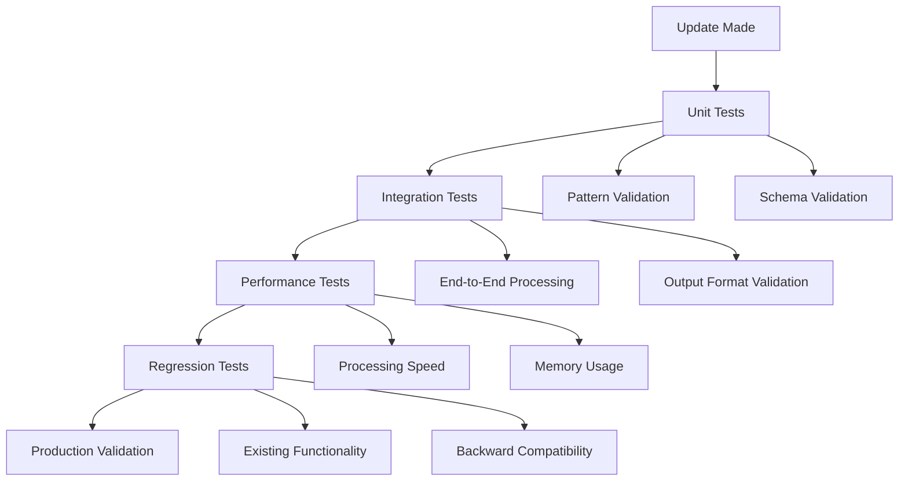

# Testing & Validation Guide

## 📋 Overview

This guide provides comprehensive testing and validation procedures for your FinDocPipeline system updates. Proper testing ensures that schema and financial dictionary changes work correctly before production deployment.

## 🎯 Quick Reference

| Test Type | When to Use | Duration | Automation Level |
|-----------|-------------|----------|------------------|
| **Quick Validation** | Small changes, single terms | 5-10 min | 🟡 Semi-automated |
| **Comprehensive Testing** | Schema changes, multiple patterns | 30-60 min | 🟢 Manual |
| **Performance Testing** | Large pattern sets, optimization | 15-30 min | 🟡 Semi-automated |
| **Regression Testing** | Major updates, production deployment | 60-90 min | 🔴 Manual |

## 🧪 Testing Framework Overview

### Testing Hierarchy


## 📝 Testing Procedures

### Procedure 1: Quick Validation Testing

#### When to Use
- Adding single financial terms
- Minor pattern adjustments
- Quick verification of changes

#### Steps

1. **Prepare Test Environment**
```python
# Create test document with known content
test_content = """
Total revenue was $125.5 million in Q1 2024.
Net income increased to $45.2 billion.
EBITDA margin improved to 15.3%.
Carbon emissions were reduced by 1,250 tons.
ESG score improved to 8.5 out of 10.
"""
```

2. **Test Financial Dictionary Updates**
```python
# Test new terms detection
def test_financial_terms_detection():
    # Save test content to temporary file
    with tempfile.NamedTemporaryFile(mode='w', suffix='.txt', delete=False) as f:
        f.write(test_content)
        test_file_path = f.name
    
    # Process through pipeline
    processor = NLPDataProcessor()
    
    # Check if new terms are detected
    has_financial_terms = processor._has_financial_terms(test_content)
    
    print(f"Financial terms detected: {has_financial_terms}")
    
    # Clean up
    os.unlink(test_file_path)
    
    return has_financial_terms

# Run test
result = test_financial_terms_detection()
assert result == True, "Financial terms should be detected"
```

3. **Test Pattern Recognition**
```python
def test_pattern_extraction():
    extractor = DeduplicatedMetricsExtractor()
    
    # Test specific patterns
    test_patterns = {
        'revenue': [r'revenue[:\s]+[\$£€]?([\d,\.]+)\s*(million|billion|m|b|k)?'],
        'esg_score': [r'esg\s+score[:\s]+([\d,\.]+)']
    }
    
    results = []
    for pattern_name, patterns in test_patterns.items():
        for pattern in patterns:
            matches = re.findall(pattern, test_content, re.IGNORECASE)
            results.append({
                'pattern': pattern_name,
                'matches': matches,
                'count': len(matches)
            })
    
    return results

# Run pattern test
pattern_results = test_pattern_extraction()
for result in pattern_results:
    print(f"Pattern {result['pattern']}: {result['count']} matches - {result['matches']}")
```

4. **Validation Checklist**
- [ ] New terms are detected in `has_financial_terms`
- [ ] Pattern matches return expected values
- [ ] No regex errors or exceptions
- [ ] Processing completes without errors

### Procedure 2: Comprehensive Testing

#### When to Use
- Schema structure changes
- Multiple pattern updates
- Major functionality additions

#### Steps

1. **Prepare Test Documents**
```python
# Create comprehensive test suite
test_documents = {
    'financial_report': """
    ANNUAL FINANCIAL REPORT 2024
    
    Revenue Performance:
    - Total revenue: $1.25 billion
    - Gross revenue: $1.35 billion
    - Net revenue: $1.15 billion
    - Operating revenue: $1.20 billion
    
    Profitability Metrics:
    - Net income: $245.5 million
    - Operating profit: $325.8 million
    - EBITDA: $425.2 million
    - Gross profit: $485.7 million
    
    Balance Sheet:
    - Total assets: $5.2 billion
    - Shareholders equity: $2.1 billion
    - Cash and equivalents: $850 million
    
    ESG Metrics:
    - Carbon emissions: 125,000 tons CO2e
    - Renewable energy: 65% of total consumption
    - ESG score: 8.7/10
    - Sustainability rating: A+
    """,
    
    'crypto_report': """
    CRYPTOCURRENCY HOLDINGS REPORT Q1 2024
    
    Digital Asset Portfolio:
    - Bitcoin holdings: 1,250.5 BTC
    - Ethereum holdings: 15,750 ETH
    - Total crypto revenue: $45.2 million
    - Staking rewards: $2.1 million
    
    Blockchain Operations:
    - Mining revenue: $12.5 million
    - Transaction fees: $3.2 million
    - DeFi protocol revenue: $8.7 million
    """,
    
    'banking_report': """
    BANKING REGULATORY REPORT 2024
    
    Capital Adequacy:
    - Tier 1 capital ratio: 12.5%
    - CET1 ratio: 11.2%
    - Total capital ratio: 15.8%
    
    Performance Metrics:
    - Net interest margin: 3.25%
    - Return on equity: 12.8%
    - Return on assets: 1.15%
    
    Credit Quality:
    - Loan loss provision: $125 million
    - Credit loss provision: $98 million
    - Allowance for credit losses: $245 million
    """
}
```

2. **Full Pipeline Testing**
```python
def comprehensive_pipeline_test():
    results = {}
    
    for doc_name, content in test_documents.items():
        print(f"\nTesting document: {doc_name}")
        
        # Create temporary PDF-like structure
        with tempfile.NamedTemporaryFile(mode='w', suffix='.txt', delete=False) as f:
            f.write(content)
            temp_path = f.name
        
        try:
            # Test each component
            parser = ComprehensiveFinancialParser()
            nlp_processor = NLPDataProcessor()
            nlp_exporter = NLPDatasetExporter()
            metrics_extractor = DeduplicatedMetricsExtractor()
            
            # Simulate page data
            page_data = [{
                'page': 1,
                'method': 'test',
                'full_text': content,
                'word_count': len(content.split()),
                'char_count': len(content),
                'line_count': len(content.split('\n')),
                'tables': [],
                'financial_metrics': parser._extract_financial_data(content),
                'chart_indicators': parser._detect_chart_elements(content)
            }]
            
            # Test NLP processing
            raw_df = nlp_processor.create_raw_csv(page_data)
            nlp_df, _ = nlp_processor.clean_for_nlp(raw_df)
            
            # Test NLP dataset creation
            nlp_dataset_df = nlp_exporter.create_nlp_dataset(nlp_df)
            
            # Test metrics extraction
            metrics_df, debug_df = metrics_extractor.extract_metrics_enhanced(nlp_df)
            
            # Store results
            results[doc_name] = {
                'pages_processed': len(page_data),
                'raw_rows': len(raw_df),
                'nlp_rows': len(nlp_df),
                'nlp_dataset_rows': len(nlp_dataset_df),
                'metrics_extracted': len(metrics_df),
                'financial_metrics': page_data[0]['financial_metrics'],
                'chart_indicators': page_data[0]['chart_indicators'],
                'processing_success': True
            }
            
        except Exception as e:
            results[doc_name] = {
                'processing_success': False,
                'error': str(e)
            }
        
        finally:
            os.unlink(temp_path)
    
    return results

# Run comprehensive test
test_results = comprehensive_pipeline_test()

# Display results
for doc_name, result in test_results.items():
    print(f"\n=== {doc_name.upper()} ===")
    if result['processing_success']:
        print(f"✅ Processing successful")
        print(f"   Pages: {result['pages_processed']}")
        print(f"   NLP rows: {result['nlp_rows']}")
        print(f"   Metrics: {result['metrics_extracted']}")
        print(f"   Financial metrics: {result['financial_metrics']}")
    else:
        print(f"❌ Processing failed: {result['error']}")
```

3. **Schema Validation Testing**
```python
def test_schema_compliance():
    """Test output compliance with schema definitions"""
    
    # Load reference schema
    with open('complete_system_schema_export.json', 'r') as f:
        reference_schema = json.load(f)
    
    validation_results = []
    
    # Test page data schema
    sample_page_data = {
        'page': 1,
        'method': 'pdfplumber_comprehensive',
        'full_text': 'Sample text',
        'word_count': 2,
        'char_count': 11,
        'line_count': 1,
        'tables': [],
        'financial_metrics': {},
        'chart_indicators': []
    }
    
    # Validate required fields
    required_fields = reference_schema['core_system_schemas']['page_data_schema']['required_fields']
    
    for field_name, field_spec in required_fields.items():
        if field_name in sample_page_data:
            actual_type = type(sample_page_data[field_name]).__name__
            expected_type = field_spec['type']
            
            # Type mapping
            type_mapping = {
                'integer': 'int',
                'string': 'str',
                'array': 'list',
                'object': 'dict'
            }
            
            expected_python_type = type_mapping.get(expected_type, expected_type)
            
            validation_results.append({
                'field': field_name,
                'expected_type': expected_type,
                'actual_type': actual_type,
                'valid': actual_type == expected_python_type
            })
        else:
            validation_results.append({
                'field': field_name,
                'expected_type': field_spec['type'],
                'actual_type': 'missing',
                'valid': False
            })
    
    return validation_results

# Run schema validation
schema_results = test_schema_compliance()
for result in schema_results:
    status = "✅" if result['valid'] else "❌"
    print(f"{status} {result['field']}: {result['actual_type']} (expected: {result['expected_type']})")
```

### Procedure 3: Performance Testing

#### When to Use
- Large pattern sets
- Performance optimization
- Production readiness assessment

#### Steps

1. **Processing Speed Test**
```python
import time
import psutil
import os

def performance_test():
    """Test processing performance with various document sizes"""
    
    # Create test documents of different sizes
    base_text = """
    Total revenue was $125.5 million in Q1 2024.
    Net income increased to $45.2 billion.
    EBITDA margin improved to 15.3%.
    Carbon emissions were reduced by 1,250 tons.
    ESG score improved to 8.7 out of 10.
    """
    
    test_sizes = {
        'small': base_text,
        'medium': base_text * 10,
        'large': base_text * 100,
        'xlarge': base_text * 500
    }
    
    performance_results = {}
    
    for size_name, content in test_sizes.items():
        print(f"\nTesting {size_name} document ({len(content)} characters)")
        
        # Memory before
        process = psutil.Process(os.getpid())
        memory_before = process.memory_info().rss / 1024 / 1024  # MB
        
        start_time = time.time()
        
        try:
            # Run full pipeline
            parser = ComprehensiveFinancialParser()
            nlp_processor = NLPDataProcessor()
            metrics_extractor = DeduplicatedMetricsExtractor()
            
            # Simulate processing
            page_data = [{
                'page': 1,
                'method': 'test',
                'full_text': content,
                'word_count': len(content.split()),
                'char_count': len(content),
                'line_count': len(content.split('\n')),
                'tables': [],
                'financial_metrics': parser._extract_financial_data(content),
                'chart_indicators': parser._detect_chart_elements(content)
            }]
            
            raw_df = nlp_processor.create_raw_csv(page_data)
            nlp_df, _ = nlp_processor.clean_for_nlp(raw_df)
            metrics_df, _ = metrics_extractor.extract_metrics_enhanced(nlp_df)
            
            end_time = time.time()
            
            # Memory after
            memory_after = process.memory_info().rss / 1024 / 1024  # MB
            
            performance_results[size_name] = {
                'processing_time': round(end_time - start_time, 3),
                'memory_used': round(memory_after - memory_before, 2),
                'characters_processed': len(content),
                'words_processed': len(content.split()),
                'metrics_found': len(metrics_df),
                'chars_per_second': round(len(content) / (end_time - start_time), 0),
                'success': True
            }
            
        except Exception as e:
            performance_results[size_name] = {
                'success': False,
                'error': str(e)
            }
    
    return performance_results

# Run performance test
perf_results = performance_test()

# Display results
print("\n=== PERFORMANCE TEST RESULTS ===")
for size, result in perf_results.items():
    if result['success']:
        print(f"\n{size.upper()}:")
        print(f"  Processing time: {result['processing_time']}s")
        print(f"  Memory used: {result['memory_used']} MB")
        print(f"  Characters/second: {result['chars_per_second']}")
        print(f"  Metrics found: {result['metrics_found']}")
    else:
        print(f"\n{size.upper()}: ❌ Failed - {result['error']}")
```

2. **Pattern Performance Test**
```python
def test_pattern_performance():
    """Test individual pattern performance"""
    
    extractor = DeduplicatedMetricsExtractor()
    test_text = base_text * 100  # Large text for testing
    
    pattern_performance = {}
    
    for metric_name, patterns in extractor.metric_patterns.items():
        start_time = time.time()
        total_matches = 0
        
        for pattern in patterns:
            matches = re.findall(pattern, test_text, re.IGNORECASE)
            total_matches += len(matches)
        
        end_time = time.time()
        
        pattern_performance[metric_name] = {
            'processing_time': round(end_time - start_time, 4),
            'matches_found': total_matches,
            'patterns_count': len(patterns)
        }
    
    return pattern_performance

# Run pattern performance test
pattern_perf = test_pattern_performance()

print("\n=== PATTERN PERFORMANCE ===")
for metric, perf in sorted(pattern_perf.items(), key=lambda x: x[1]['processing_time'], reverse=True):
    print(f"{metric}: {perf['processing_time']}s ({perf['matches_found']} matches, {perf['patterns_count']} patterns)")
```

### Procedure 4: Regression Testing

#### When to Use
- Major system updates
- Before production deployment
- Quarterly system validation

#### Steps

1. **Baseline Comparison Test**
```python
def regression_test():
    """Compare current results with known baseline"""
    
    # Known good test cases with expected results
    baseline_tests = [
        {
            'name': 'Basic Revenue Detection',
            'text': 'Total revenue was $125.5 million',
            'expected_metrics': ['revenue'],
            'expected_values': ['125.5']
        },
        {
            'name': 'Multiple Metrics',
            'text': 'Revenue $100M, Net income $25M, EBITDA $35M',
            'expected_metrics': ['revenue', 'net_income', 'ebitda'],
            'expected_values': ['100', '25', '35']
        },
        {
            'name': 'ESG Metrics',
            'text': 'Carbon emissions 1,250 tons, ESG score 8.5',
            'expected_metrics': ['carbon_emissions', 'esg_score'],
            'expected_values': ['1,250', '8.5']
        }
    ]
    
    regression_results = []
    extractor = DeduplicatedMetricsExtractor()
    
    for test_case in baseline_tests:
        # Create test dataframe
        test_df = pd.DataFrame([{
            'page_number': 1,
            'cleaned_text': test_case['text'],
            'content_type': 'test'
        }])
        
        # Extract metrics
        metrics_df, _ = extractor.extract_metrics_enhanced(test_df)
        
        # Check results
        found_metrics = metrics_df['metric_name'].tolist()
        found_values = metrics_df['metric_value'].tolist()
        
        test_result = {
            'test_name': test_case['name'],
            'expected_metrics': test_case['expected_metrics'],
            'found_metrics': found_metrics,
            'expected_values': test_case['expected_values'],
            'found_values': found_values,
            'metrics_match': set(found_metrics) >= set(test_case['expected_metrics']),
            'values_match': all(val in found_values for val in test_case['expected_values'])
        }
        
        test_result['overall_pass'] = test_result['metrics_match'] and test_result['values_match']
        regression_results.append(test_result)
    
    return regression_results

# Run regression test
regression_results = regression_test()

print("\n=== REGRESSION TEST RESULTS ===")
for result in regression_results:
    status = "✅ PASS" if result['overall_pass'] else "❌ FAIL"
    print(f"{status} {result['test_name']}")
    if not result['overall_pass']:
        print(f"  Expected metrics: {result['expected_metrics']}")
        print(f"  Found metrics: {result['found_metrics']}")
        print(f"  Expected values: {result['expected_values']}")
        print(f"  Found values: {result['found_values']}")
```

## 🔍 Validation Checklists

### Pre-Deployment Checklist

#### Financial Dictionary Updates
- [ ] New terms added to all required locations
- [ ] Terms are lowercase and properly formatted
- [ ] No duplicate terms in lists
- [ ] Terms tested with sample documents
- [ ] Performance impact assessed

#### Schema Structure Updates
- [ ] New fields added to correct schema locations
- [ ] Data types are consistent and valid
- [ ] Default values provided for new fields
- [ ] Backward compatibility maintained
- [ ] Reference schema JSON updated

#### Pattern Recognition Updates
- [ ] Regex patterns tested with online validators
- [ ] Patterns tested against sample text
- [ ] No regex syntax errors
- [ ] Performance impact acceptable
- [ ] Pattern priority order optimized

### Post-Deployment Checklist

#### Immediate Validation (0-15 minutes)
- [ ] Streamlit application starts without errors
- [ ] Sample document processes successfully
- [ ] New features appear in output
- [ ] No obvious errors in logs

#### Extended Validation (15-60 minutes)
- [ ] Multiple document types tested
- [ ] Output format consistency verified
- [ ] Performance benchmarks met
- [ ] Error handling works correctly

#### Production Monitoring (Ongoing)
- [ ] Processing times within acceptable range
- [ ] Memory usage stable
- [ ] Error rates normal
- [ ] User feedback positive

## 🚨 Troubleshooting Common Issues

### Issue 1: New Terms Not Detected
**Symptoms**: Terms present in document but not flagged as financial terms

**Diagnosis**:
```python
# Test term detection
test_text = "Your document text here"
processor = NLPDataProcessor()
result = processor._has_financial_terms(test_text)
print(f"Financial terms detected: {result}")

# Check individual terms
financial_terms = ['your', 'new', 'terms']
text_lower = test_text.lower()
for term in financial_terms:
    found = term in text_lower
    print(f"Term '{term}': {'Found' if found else 'Not found'}")
```

**Solutions**:
- Verify terms added to correct location
- Check spelling and case sensitivity
- Restart Streamlit application
- Verify terms exist in document

### Issue 2: Regex Pattern Errors
**Symptoms**: `re.error` exceptions, pattern not matching

**Diagnosis**:
```python
# Test regex pattern
import re
pattern = r'your[:\s]+pattern[:\s]+([\d,\.]+)'
test_text = "your test text"

try:
    matches = re.findall(pattern, test_text, re.IGNORECASE)
    print(f"Matches found: {matches}")
except re.error as e:
    print(f"Regex error: {e}")
```

**Solutions**:
- Escape special characters (`$` → `\$`)
- Test patterns with online regex validators
- Use raw strings (`r'pattern'`)
- Check parentheses balancing

### Issue 3: Performance Degradation
**Symptoms**: Slow processing, high memory usage

**Diagnosis**:
```python
# Profile pattern performance
import time
start_time = time.time()
# Your pattern matching code here
end_time = time.time()
print(f"Processing time: {end_time - start_time}s")
```

**Solutions**:
- Simplify complex patterns
- Reduce number of patterns
- Use non-capturing groups `(?:...)`
- Optimize pattern order (specific first)

## 📚 Related Guides

- **[Master Guide](MASTER_SCHEMA_UPDATE_GUIDE.md)**: Overview and navigation
- **[Financial Dictionary Guide](FINANCIAL_DICTIONARY_UPDATE_GUIDE.md)**: Term management
- **[Schema Structure Guide](SCHEMA_STRUCTURE_UPDATE_GUIDE.md)**: Data structure updates
- **[Pattern Recognition Guide](PATTERN_RECOGNITION_UPDATE_GUIDE.md)**: Pattern updates
- **[Deployment Guide](DEPLOYMENT_ROLLBACK_GUIDE.md)**: Production deployment

---

## 📝 Version Control

**Last Updated**: January 6, 2025  
**Compatible with**: FinDocPipeline v2.0.0  
**Guide Version**: 1.0.0